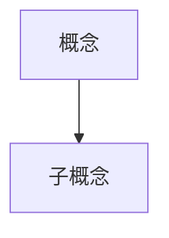

# Paper Tutor

Multi-agent swarm system for teaching academic papers through deep, parallel chapter explanations.

## Core Philosophy

Paper Tutor uses a **swarm of specialized agents** to transform complex academic papers into understandable, interconnected lessons. Unlike summarization, this skill focuses on **teaching and understanding**.

**Key architectural principles:**

1. **Teaching, not summarizing**: Each concept is explained with prerequisites, examples, visualizations, and context
2. **Swarm communication**: Chapter agents coordinate through shared working memory to avoid redundancy and ensure coherence
3. **Arbitration by Editor-in-Chief**: Separate role from coordinator; handles terminology disputes and concept ownership
4. **External resource integration**: Agents search for tutorials, blog posts, and lectures to enhance explanations
5. **Multi-modal explanation**: Text + Mermaid diagrams + formula breakdowns + prerequisite knowledge boxes

## Workflow Overview

```
Pre-Step: Determine Output Location
  ↓
Step 0: Paper Structure Extraction
  ↓
Step 0.5: Figure Extraction (REQUIRED)
  ↓
Step 1: Initialize Shared Working Memory
  ↓
Step 2: Launch Chapter Agents (Parallel)
  ↓
Step 3: Agent Coordination (Concept Arbitration, Terminology)
  ↓
Step 4: Generate Final Output
```

## Intensity Levels

| Level | Total Words | Per Concept | External Resources | Agent Count |
|-------|-------------|-------------|-------------------|-------------|
| **Light** | ~5,000 | 200-500 | Minimal (only when critical) | 2-3 |
| **Medium** | ~30,000 | 1,000-3,000 | Curated recommendations | 4-6 |
| **Heavy** | ~100,000 | 5,000-20,000 | Integrated into explanations | Per-chapter |

---

## Pre-Step: Determine Output Location

**Action**: Ask user where to save the paper explanation.

**Recommended format**: `paper_tutor_YYYY-MM-DD_[paper-slug]/`

**Example**: "Attention Is All You Need" → `paper_tutor_2026-02-22_attention-is-all-you-need/`

---

## Step 0: Paper Structure Extraction

**Action**: Extract and parse the paper structure.

**Input formats**:
- PDF file (local path)
- ArXiv URL
- Direct PDF URL
- HTML paper page

**Extract**:
- Title, authors, year
- Chapter/section hierarchy
- All figures and tables
- All equations (LaTeX)
- References

**Output**: `paper_metadata.json` with structure map

---

## Step 0.5: Figure Extraction

**Action**: Extract all figures from the PDF for later reference.

**IMPORTANT**: This step is REQUIRED for proper figure handling. Without it, chapter agents will not have access to paper figures.

**How to extract figures**:

### Method 1: Using the provided Python script (Recommended)

This method extracts **both bitmap images AND vector graphics** (diagrams, flowcharts, architecture figures).

```bash
python ~/.claude/skills/paper-tutor/scripts/extract_figures.py [PDF_PATH] -o [OUTPUT_DIR]/figures/

# Example
python ~/.claude/skills/paper-tutor/scripts/extract_figures.py paper.pdf -o ./figures/
```

**Requirements**:
```bash
pip install pymupdf Pillow imagehash
```

### Method 2: Using pdfimages (Bitmap only)

If you only need embedded bitmap images (photos, plots, etc.):

```bash
# Requires poppler-utils
# macOS: brew install poppler
pdfimages -all [PDF_PATH] [OUTPUT_DIR]/figures/fig
```

**Limitation**: `pdfimages` cannot extract vector graphics (diagrams, flowcharts, etc.)

**Output**:
- `[OUTPUT_DIR]/figures/` directory containing all extracted figures
- Files named: `fig_[page]_[index]_[hash].png` (Python script) or `fig-000.png` (pdfimages)

**For detailed extraction logic**, see [references/figure-extraction.md](references/figure-extraction.md)

---

## Step 1: Initialize Shared Working Memory

Create the shared memory structure that all agents will access.

**For detailed schema**, see [references/shared-memory-schema.md](references/shared-memory-schema.md)

**Key components**:
- **Paper metadata + chapter summaries** (not full text - each agent loads their own chapter)
- **Terminology registry** with challenge mechanism
- **Concept coverage map** (who explains what)
- **Communication logs** (broadcast + directed messages)
- **External resource library**
- **Progress tracking**

---

## Step 2: Launch Chapter Agents (Parallel)

Launch N chapter agents simultaneously, one per major section.

**Agent assignments**:
- Agent 1: Abstract + Introduction
- Agent 2: Related Work
- Agent 3: Methodology
- Agent 4: Experiments
- Agent 5: Results + Discussion
- Agent 6: Conclusion
- (Adjust based on paper structure)

**For detailed chapter agent prompts**, see [references/chapter-agent-workflow.md](references/chapter-agent-workflow.md)

**Each chapter agent**:

1. **Reads their assigned chapter** (full text)
2. **Checks shared memory** for:
   - What concepts are already explained?
   - What terms are defined?
   - What external resources exist?
3. **Identifies** core concepts in their chapter
4. **For each concept**:
   - Check if already covered → if yes, decide to reference or negotiate ownership
   - Search external resources (tutorials, blogs, lectures)
   - Create Mermaid visualizations if applicable
   - Explain with prerequisites, examples, connections
5. **Updates shared memory** with:
   - Concepts they explain
   - Terms they define
   - External resources they find
6. **Communicates** with other agents as needed

---

## Step 3: Agent Coordination

### Concept Ownership Negotiation

When Agent A finds a concept already claimed by Agent B:

```
Agent A assesses:
  "Is this concept more central to my chapter?"
  "Is my explanation different/better?"
  "Should we both explain it (different perspectives)?"
        │
        ┌───────┴───────┐
        │               │
    Don't dispute    Negotiate
        │               │
        ▼               ▼
    Reference B    Message B + Editor-in-Chief
                    │
                    ▼
            Editor-in-Chief arbitrates:
            • Read full paper
            • Assess primary location
            • Decide: single owner vs split explanations
```

### Terminology Challenges

```
Agent B defines term X
        │
        ▼
Agent A (in different chapter) finds the definition incomplete/wrong
        │
        ▼
Agent A issues challenge → writes to shared memory
        │
        ▼
Editor-in-Chief receives challenge
        │
        ▼
Arbitration:
  1. Read both definitions
  2. Check term usage across paper
  3. Decision: keep A / keep B / merge / split by context
        │
        ▼
Update shared memory with arbitration result
```

**Roles**:
- **Coordinator**: Manages task assignment, progress tracking, basic coordination
- **Editor-in-Chief**: Has full paper access, arbitrates content disputes, ensures consistency

---

## Step 4: Generate Final Output

After all agents complete, generate the final organized explanation.

**Output structure**:

```markdown
# [Paper Title] - 深度讲解 [强度: Medium]

## 论文概览
- 标题、作者、发表信息
- 核心贡献概述
- 章节导航

---

## 第一章：引言

### 📚 前置知识
> 在阅读本章前，你需要理解以下概念：

#### 概念A：[名称]
[简洁讲解，200字以内]

### 🎯 本章核心概念

#### 概念1：[名称]

**原文定义**：[引用原文]

**通俗讲解**：
[详细讲解，1000-3000字，视强度而定]

**可视化理解**：


**举例说明**：
[具体例子]

### 📊 本章图表讲解

#### 图1：[原标题]
**图意**：这张图想要表达的是...

**如何阅读**：
1. 首先看X轴代表...
2. Y轴表示...

**简化示意图**：
```mermaid
...
```

---

## 第二章：方法

[Agent 2 的讲解内容]

---

... (按原论文章节顺序)

---

## 附录

### A. 术语表
- 所有定义的术语及统一说明

### B. 外部资源推荐
- 教程、博客、视频链接

### C. 可视化索引
- 所有 Mermaid 图的汇总
```

**Output file**: `paper_explanation.md`

---

## File Structure

```
[OUTPUT_DIR]/
├── paper_explanation.md              # Main output
├── paper_metadata.json               # Extracted structure
├── shared_memory.json                # Final shared memory state
├── figures/                          # Extracted paper figures (REQUIRED)
│   ├── fig_0_1_abc123.png           # Bitmap images
│   ├── vector_3_0_def456.png        # Vector graphics rendered to PNG
│   └── ...
├── chapters/                         # Individual agent outputs
│   ├── chapter_01_agent_output.md
│   ├── chapter_02_agent_output.md
│   └── ...
└── external_resources/               # Downloaded/saved resources
    ├── chapter_01/
    └── ...
```

---

## Tool Usage

### Main Coordinator
- **AskUserQuestion**: Get paper source, intensity level, output location
- **Task**: Launch all sub-agents
- **Write**: Create directory structure, initialize shared memory
- **Bash**: Run `extract_figures.py` script to extract figures from PDF
- **pdf**: Extract paper content from PDF

### Figure Extraction (Step 0.5)
- **Bash**: `python ~/.claude/skills/paper-tutor/scripts/extract_figures.py [PDF] -o [OUTPUT]/figures/`
- **pdf**: Alternative method to extract images from PDF

### Chapter Agents
- **Read**: Access shared memory, their assigned chapter
- **mcp__brave-search__brave_web_search**: Find external resources
- **mcp__fetch__fetch**: Extract content from tutorials/blogs
- **Write**: Generate chapter explanations, update shared memory

### Editor-in-Chief
- **Read**: Full paper access, shared memory, challenge requests
- **Write**: Update terminology registry, arbitration results

---

## Progressive Disclosure

**Detailed implementation references**:

- **Shared memory schema**: [references/shared-memory-schema.md](references/shared-memory-schema.md) - Complete structure
- **Chapter agent workflow**: [references/chapter-agent-workflow.md](references/chapter-agent-workflow.md) - Detailed prompts
- **Formula explanation template**: [references/formula-template.md](references/formula-template.md) - How to explain equations
- **Figure extraction guide**: [references/figure-extraction.md](references/figure-extraction.md) - How to extract figures from PDF
- **Figure handling guide**: [references/figure-guide.md](references/figure-guide.md) - Mermaid vs original figures

---

## Tips

**When to use each intensity**:
- **Light**: Quick understanding of main ideas (30-60 min read)
- **Medium**: Deep dive for researchers (3-5 hours read)
- **Heavy**: Comprehensive study for implementation (10+ hours read)

**Quality indicators**:
- Good explanations use analogies and examples
- Every technical term is either explained or linked to terminology registry
- Formulas include boundary conditions and practical implications
- Figures are "taught" not just described

**Agent communication best practices**:
- Always check shared memory before explaining a concept
- Issue challenges politely with specific reasons
- Use broadcast for global updates (external resources, terminology)
- Use directed messages for specific negotiations
