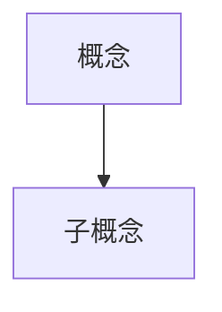

# Paper Tutor

Multi-agent swarm system for teaching academic papers through deep, parallel chapter explanations.

## Core Philosophy

Paper Tutor uses a **swarm of specialized agents** to transform complex academic papers into understandable, interconnected lessons. Unlike summarization, this skill focuses on **teaching and understanding**.

**Key architectural principles:**

1. **Teaching, not summarizing**: Each concept is explained with prerequisites, examples, visualizations, and context
2. **Swarm communication**: Chapter agents coordinate through shared working memory to avoid redundancy and ensure coherence
3. **Specialized roles with clear boundaries**:
   - **Coordinator**: Task assignment, progress tracking
   - **Figure Analyst**: ONLY agent allowed to write figure analysis (enforced by signature)
   - **Chapter Agents**: Explain concepts, update shared memory (CANNOT write figure analysis)
   - **Editor-in-Chief**: Reviews all chapter outputs, must approve with score >= 4.0
4. **Structural enforcement**: Constraints are enforced through data signatures, not rules
5. **Multi-modal explanation**: Text + Mermaid diagrams + formula breakdowns + prerequisite knowledge boxes

---

## Non-negotiable Multi-modal Rules

**These rules exist because past runs produced (a) text-only walls of description that failed to teach figures and formulas, (b) figure-centric "museum tours" where every `####` heading was the name of a figure, and (c) Q&A-style output that feels like a review quiz rather than a coherent lecture. They are enforced by the validator and the Editor-in-Chief.**

0. **Teaching philosophy: narrative lecture, not Q&A review.** This is the most important rule and it dominates all others.
   - **Your chapter reads like a lecture, not a list of answered questions.** Imagine a teacher explaining this paper to a student who has NEVER read it. The teacher does not say "Now let me ask you: why does X fail?" — the teacher says "Let's look at why X fails" and builds up the explanation layer by layer. Your reader should be able to follow the entire chapter without ever having opened the original paper.
   - **Every `####` heading must be a declarative narrative topic**, not a question and not a figure name. Headings are signposts that tell the reader "here's what I'm about to explain to you" — they should be short declarative phrases or statements.
     - Good: `#### 传统 concolic execution 的两大根本瓶颈`
     - Good: `#### 核心洞察：从实现级跃迁到语义级`
     - Good: `#### 浮点数程序案例：传统方法 vs. ConcoLLMic`
     - Good: `#### 系统的完整图景与两个范式级改变`
     - Bad: `#### 传统 concolic execution 面临哪两个根本挑战，以至于几十年的工程努力仍无法攻克？` (question — feels like a review quiz)
     - Bad: `#### 概念 3：Venn 图（Figure 5）` (figure name — museum tour)
   - **Hard-fail patterns**: `####` headings that (a) end with `？` (question mark), (b) match `Figure \d+` / `图 \d+` / `Table [IVX]+` / `表 [IVX]+` / `Listing \d+` / `清单 \d+` (including inside parentheses), or (c) are phrased as interrogative sentences are rejected by the Editor-in-Chief and by `validate_execution.py`.
   - **Chapter-level narrative arc is mandatory.** Each chapter must have:
     1. An **opening orientation** (1-3 sentences after `### 🎯 核心讲解`, NOT under 前置知识) that tells the reader: "In this section, we will understand X. The key insight is Y, and we'll build up to it step by step." This gives the reader a roadmap. **`### 🎯 核心讲解` MUST appear as its own H3 heading** to break out of the 前置知识 nesting — without it, all `####` topics will appear as children of 前置知识 in the document outline.
     2. **Smooth transitions** between `####` sections. The end of each section should naturally lead into the next one (e.g., "现在我们理解了 X 的瓶颈所在，接下来看看 ConcoLLMic 如何通过 Y 来突破它。").
     3. A **closing synthesis** at the end that ties all sections together and bridges to the next chapter.
   - **2+ figures supporting one topic live in the SAME `####` section**, bound by narrative hinges ("此时", "然而", "到这里"), not in 2+ separate `####` sections. See `references/multimodal-content.md` Example 0 for the primary pattern.
   - **One figure → one section is OK only when that figure single-handedly illustrates one complete topic.** But if your chapter has 4+ figures, you almost certainly should NOT have 4+ separate `####` sections.
   - **Common rationalizations that mean you are violating this rule** (call yourself out):
     - "This figure is so important it deserves its own section." → No. Its own *narrative paragraph* in an existing topic, yes.
     - "The 4 figures each show a different step, so they need 4 sections." → No. A 4-step process IS the topic; weave all 4 figures into one section.
     - "The reader needs to see each figure separately." → They will. Separation is done by narrative paragraphs, not `####` headings.
     - "I'll use questions as headings to be engaging." → No. Questions make the text feel like a quiz. A lecture is engaging through clear explanation, not through interrogation.

1. **Figures are the soul of a paper — they MUST render, not be described.**
   - Every figure (Figure N / Table N / Listing N) extracted by `extract_figures.py` MUST appear as `` markdown in at least one chapter file, positioned at or near the text that discusses it.
   - **Forbidden**: dumping all figures into a single "figure index table", listing them only by filename in an appendix, or writing "see Figure 3 at page 5" without actually rendering the image.
   - **Forbidden path prefixes**: `../figures/`, absolute paths, external URLs. The ONLY allowed path is `figures/<filename>` (relative to the chapter file) or normalized to `figures/<filename>` during final merge.
   - Every embedded figure MUST be embedded INSIDE a proposition's narrative (not as its own `####`). The surrounding narrative must be at least 150 Chinese characters, **written as flowing prose** (not as a `**什么要看** / **结构** / **观察**` bullet list) that dissolves the `level2_breakdown` fields into the argument. A single caption line is NOT enough. A bullet list of level2_breakdown fields is also NOT enough — the test is whether the narrative reads as a continuous argument for the proposition.

2. **Formulas must render as LaTeX, not prose.**
   - Inline math: wrap the expression in single dollar signs (`\$expr\$`).
   - Display math: wrap the expression in double dollar signs (`\$\$expr\$\$`) on its own block.
   - Every non-trivial symbol must be named. Every bound/limit must be explained.
   - **Forbidden**: rendering formulas as plain text (e.g. "f(x) = sum from i=1 to n of x_i") or as screenshot images when LaTeX is possible.
   - If the paper contains no formulas, this rule is inert — do not fabricate formulas just to satisfy it.
   - Full example: see `references/multimodal-content.md`.

3. **Tables from the paper are figures.**
   - `extract_figures.py` emits tables under `figures/table_*.png`. They follow the same embedding rules as figures.
   - Do NOT re-type the table data into a markdown table instead of embedding the rendered image unless the table is small (≤ 5 rows) AND you add a separate teaching paragraph.

4. **Code listings follow the same ownership rules as figures.**
   - Listings extracted to `listings/listing_*.txt` should be embedded as fenced code blocks (` ```c ` / ` ```python ` etc.) close to the related concept.

**Agents that violate these rules will have their chapters rejected by the Editor-in-Chief regardless of text quality.**

---

## Workflow Overview

```
Pre-Step A: Dependency Check
  ↓
Pre-Step B: Determine Output Location
  ↓
Step 0: Paper Structure Extraction
  ↓
Step 1: Initialize Shared Working Memory
  ↓
Step 2: Figure Extraction & Analysis (by Figure Analyst Agent)
  ↓
Step 3: Launch Chapter Agents (Parallel)
  ↓
Step 4: Editor-in-Chief Review (Each chapter must pass with score >= 4.0)
  ↓
Step 5: Agent Coordination (Concept Arbitration, Terminology)
  ↓
Step 6: Generate Final Output
  ↓
Step 7: Validation (Run validate_execution.py)
```

---

## Intensity Levels

| Level | Total Words | Chapter Agents | Per Concept | External Resources |
|-------|-------------|----------------|-------------|-------------------|
| **Light** | ~5,000 | 2 | 200-500 | Minimal (only when critical) |
| **Medium** | ~30,000 | 4-6 | 1,000-3,000 | Curated recommendations |
| **Heavy** | ~100,000 | Per-chapter | 5,000-20,000 | Integrated into explanations |

**Note**: Architecture is the same for all levels. Only agent count and depth vary.

---

## Pre-Step A: Dependency Check

**Action**: Check Python package prerequisites before running any scripts.

```bash
python ~/.claude/skills/paper-tutor/scripts/check_dependencies.py
```

The checker verifies three things and exits non-zero on any failure:

1. **Python interpreter version** — PyMuPDF wheels lag CPython releases by weeks; an unsupported interpreter (e.g. CPython 3.14 shortly after release) cannot build the wheel. The checker refuses to proceed and tells the user to install a supported interpreter (e.g. `brew install python@3.12` on macOS, then create a venv from it).
2. **Required packages** — `pymupdf`, `Pillow`, `imagehash` must all import.
3. **PyMuPDF minimum version** — extract_figures.py needs `pymupdf >= 1.23`; older builds lack APIs used by the caption-anchored crop logic.

If any check fails:

1. Ask user permission before any installation.
2. If the checker reports a Python-version problem, packages cannot be installed into that interpreter — the user MUST switch interpreters first. Do not attempt `pip install` as a workaround.
3. For missing/outdated packages only, after user approval run:

```bash
python -m pip install -r ~/.claude/skills/paper-tutor/scripts/requirements.txt
```

4. Re-run `check_dependencies.py` and continue only when all checks pass.

If user declines installation, continue with a degraded path:
- Skip figure extraction (`Step 2.1`)
- Set `image_analysis.status = "unavailable"`
- Continue chapter teaching with text-only explanations

---

## Pre-Step B: Determine Output Location

**Action**: Ask user where to save the paper explanation.

**Default base directory**: `~/Documents/Research/`

**Recommended format**: `~/Documents/Research/paper_tutor_YYYY-MM-DD_[paper-slug]/`

**If user does not specify a location**: use the default base directory and create a folder with the recommended format.

**Example**: "Attention Is All You Need" → `~/Documents/Research/paper_tutor_2026-02-24_attention-is-all-you-need/`

---

## Step 0: Paper Structure Extraction

**Action**: Extract and parse the paper structure.

**Input formats**:
- PDF file (local path)
- ArXiv URL
- Direct PDF URL
- HTML paper page

**Extract**:
- Title, authors, year
- Chapter/section hierarchy
- All figures and tables (locations only, not analyzed yet)
- All equations (LaTeX)
- References

**Output**: Initialize `paper_metadata.json` with basic structure (figures array empty at this point)

---

## Step 1: Initialize Shared Working Memory

Create `shared_memory.json` with initial structure.

### Step 1.1: Generate Chapter Summaries

**CRITICAL**: Coordinator must generate chapter summaries during initialization.

For each chapter:
1. Extract the chapter text from the paper
2. Generate a 200-500 word summary
3. Assign to an agent
4. Set word count target based on intensity

### shared_memory.json Schema

```json
{
  "chapter_summaries": [
    {
      "chapter_id": "ch1",
      "title": "Introduction",
      "summary": "200-500 word summary...",
      "assigned_agent": "agent_1",
      "word_count_target": 5000,
      "status": "pending",
      "review_score": null,
      "reviewer": null,
      "review_comments": null
    }
  ],
  "terminology_registry": {},
  "concept_coverage_map": {},
  "communication": {
    "broadcast": [],
    "directed": []
  },
  "external_resources": [],
  "progress": {
    "coordinator": "completed"
  }
}
```

**For detailed schema**, see [references/shared-memory-schema.md](references/shared-memory-schema.md)

---

## Step 2: Figure Extraction & Analysis (by Figure Analyst)

### Step 2.1: Extract Images

**Prerequisite**: Pre-Step A dependency check passed.

```bash
python ~/.claude/skills/paper-tutor/scripts/extract_figures.py [PDF_PATH] -o [OUTPUT_DIR]
```

**Important**: `-o` must point to the OUTPUT ROOT, not to `[OUTPUT_DIR]/figures/`. The script creates `figures/` and `listings/` as subdirectories inside the root. Passing `figures/` as `-o` will produce a nested `figures/figures/` path that breaks all chapter agents.

### Step 2.2: Launch Figure Analyst Agent

**CRITICAL**: Figure Analyst is the ONLY agent allowed to write `level1_summary`, `level2_breakdown`, and `belongs_to_chapter`.

Launch via Task tool:

```
你是 Paper Tutor 的 Figure Analyst，专门负责论文图片分析与归属分配。

## 你的任务

1. 分析 `[OUTPUT_DIR]/figures/` 中的所有图片 / 表格 / Listing
2. 为每个图片生成 Level 1 summary（简短描述）和 Level 2 breakdown（教学级讲解）
3. 根据 `paper_metadata.json.chapters[]` 的章节划分，为每张图分配 `belongs_to_chapter`

## 工具选择

1. 首先使用 Read 工具读取图片（Read 工具支持图片的多模态理解）
2. 同时阅读 `[OUTPUT_DIR]/figures/extraction_index.json` 获取原始 caption 文本和页码
3. 同时阅读 `[OUTPUT_DIR]/paper_metadata.json.chapters[]` 了解章节范围
4. 如果 Read 工具无法正确描述图片，设置 `image_analysis.status = "unavailable"`

## 输出要求

更新 `[OUTPUT_DIR]/paper_metadata.json`：

```json
{
  "image_analysis": {
    "status": "available|unavailable",
    "method": "read_tool_multimodal",
    "analyzed_at": "2026-04-08T10:00:00Z"
  },
  "figures": [
    {
      "file": "figure_3_097f3eb1.png",
      "page": 5,
      "figure_number": "Figure 3",
      "caption": "原始 caption 文本（来自 extraction_index.json）",
      "belongs_to_chapter": "ch2",
      "level1_summary": "1-2 句中文摘要，说明这张图整体在讲什么、是什么类型（架构图 / 折线图 / 状态机 / 表格 / 代码清单）",
      "level2_breakdown": {
        "what_to_look_at": "读者进入这张图应优先关注的视觉焦点（例如：左上角的输入节点、红色高亮路径、Y 轴刻度）",
        "axes_or_structure": "坐标轴 / 图例 / 节点类型 / 列的含义；表格要列出各列语义",
        "key_observations": [
          "观察点 1：最显著的数据模式或结构特征",
          "观察点 2：次要但有教学价值的细节",
          "观察点 3：与其他图的对比或联系"
        ],
        "teaching_hook": "把这张图和章节核心概念连起来的一句话（给 Chapter Agent 使用）"
      },
      "figure_type": "architecture_diagram|chart|table|listing|state_machine|visualization|other",
      "key_elements": ["element1", "element2"],
      "analyzed_by": "figure_analyst_agent",
      "analyzed_at": "2026-04-08T10:00:00Z",
      "analysis_method": "read_tool_multimodal",
      "status": "analyzed"
    }
  ]
}
```

## 关键约束

1. **必须包含签名字段**（每个 figures[] 项）：
   - `analyzed_by`: 必须是 `"figure_analyst_agent"`
   - `analyzed_at`: ISO 8601 时间戳
   - `analysis_method`: 使用的分析方法

2. **必须填写 `belongs_to_chapter`**：
   - 根据 `paper_metadata.json.chapters[]` 的 `id`（如 `ch1`, `ch2`）分配
   - 分配规则：图所在 PDF 页码落在哪个章节的正文范围内，就归属那个章节
   - 一个图**只能归属一个章节**；若正文在多个章节都引用，归属第一次讲解它的章节
   - **禁止**出现 `belongs_to_chapter: null`（除非整本论文只有 1 个章节）

3. **必须填写 `level2_breakdown`**：
   - Level 2 是 Chapter Agent 真正使用的讲解素材
   - 必须同时包含 `what_to_look_at`、`axes_or_structure`、`key_observations`、`teaching_hook`
   - 对代码 Listing：`axes_or_structure` 改为描述代码结构 / 关键行含义
   - 对表格：`axes_or_structure` 必须列出所有列的语义

4. **Listing 也要分析**：
   - `extract_figures.py` 会把代码清单存到 `listings/listing_*.txt`
   - Figure Analyst 同样要为这些 Listing 创建 figures[] 条目（`figure_type: "listing"`）
   - `file` 字段写对应的 `.txt` 路径（相对 OUTPUT_DIR）

5. **如果无法分析图片**：
   - 设置 `image_analysis.status = "unavailable"`
   - figures 数组留空
   - 但在 status 消息中说明具体原因

6. **Better no display than wrong**：
   - 不确定时跳过该图片
   - 绝不编造图片内容
   - 发现图片渲染不完整（被截断、空白、重复）时，在 `status` 字段写 `"render_issue"` 并跳过

7. **渲染一致性校验**（extract_figures.py v5 之后必须执行）：

   `extraction_index.json` 的每条 figures[] 都带有 `diagnostics` 子对象：
   - `crop_class`: `full_width` / `centered_wide` / `half_width_left` / `half_width_right` / `narrow`
   - `crop_width_ratio`: crop 宽度占页面宽度的比例
   - `caption_offset_from_mid_pt`: caption 中心相对页面中线的偏移（pt）

   读取图片后对照这些字段 + caption 文本 + 论文类型做一致性检查。**若任一不一致，设置 `status: "render_issue"` 并在 `level1_summary` 中说明怀疑原因，不生成 `level2_breakdown`**（否则会误导 Chapter Agent 写错的讲解）：

   - Caption 声明多阶段架构（"4 phases", "three-stage pipeline", "A → B → C → D"）但图片里只看到 1–2 个框 / 箭头 → 很可能裁剪了一半。
   - Caption 声明 N 列的表格但图片只显示 < N/2 列 → 可能裁错列位置。
   - Caption 提到若干具体标签/名字（如 "heap-buffer-overflow, memory-leak"）但图片里没有那些文字 → 内容不对应。
   - `crop_class: "narrow"` 且 `crop_width_ratio < 0.15`：架构图 / 表格极少这么窄，大概率是截断。
   - `crop_class: "half_width_*"` 但 `caption_offset_from_mid_pt` 接近 0（|offset| < 5pt）：Caption 居中意味着该图应当是 full_width 或 centered_wide——half-width 极可能把图截掉一半。这是 v5 之前最常见的 bug 模式。
   - Table 的 `crop_width_ratio < 0.25`：表格通常 >30% 宽，过窄往往意味着 crop 落到了页脚 / 章节标题附近。

   验证脚本 `validate_execution.py` 的 `figure_rendering` 检查会重复这些规则并在失败时阻塞整条流水线；Figure Analyst 的早期标记可以让 Editor 的人读稿件时就看到问题，而不是等到最终校验才发现。
```

### Figure Analysis Signature Enforcement

The validation script checks that `level1_summary` entries have proper signatures:

```json
{
  "file": "fig_3_0.png",
  "level1_summary": "...",
  "analyzed_by": "figure_analyst_agent",  // Required if level1_summary exists
  "analyzed_at": "2026-02-25T10:00:00Z",   // Required if level1_summary exists
  "analysis_method": "read_tool_multimodal" // Required if level1_summary exists
}
```

**If a figure has `level1_summary` but missing `analyzed_by: "figure_analyst_agent"`, validation will fail.**

---

## Step 3: Launch Chapter Agents (Parallel)

Launch N chapter agents simultaneously based on intensity level.

### Chapter Agent Prompt Template

```
你是 Paper Tutor 的章节讲解智能体，负责讲解论文的「{SECTION_NAME}」章节。

## 你的任务

讲解你负责的章节，让读者真正理解其中的概念。

## 必须完成的步骤（按顺序）

### 1. 读取共享内存（CRITICAL - 第一步）

使用 Read 工具读取 `{OUTPUT_DIR}/shared_memory.json`，了解：
- chapter_summaries: 其他章节的摘要
- concept_coverage_map: 哪些概念已被其他 agent 讲解
- terminology_registry: 哪些术语已定义
- communication: 是否有发给你的消息

### 2. 读取图片元数据

使用 Read 工具读取 `{OUTPUT_DIR}/paper_metadata.json`：
- image_analysis.status: 图片分析是否可用
- figures[]: 图片列表及 Level 1 summary

**重要**：你只能 READ figures，不能 WRITE figures。

### 3. 读取你负责的章节

从 PDF 中读取「{SECTION_NAME}」的完整内容。

### 4. 先写讲解提纲（narrative-first 的入口 - 不可跳过）

**这一步是整章写作的起点，也是最容易被跳过的一步。跳过这一步就会退化为 figure-centric 或 Q&A-centric 输出。**

你的任务是为一个**没有读过这篇论文的读者**讲解这个章节的内容。像一个老师备课一样，先列出一份讲解提纲：

1. 打开一个临时记事区，写出本章要讲解的 **3–8 个主题**，按照逻辑递进顺序排列。
2. 每个主题都是**一个简短的陈述性短语**，表达你要为读者解释的一件事情。主题之间应该有逻辑递进关系（铺垫 → 核心 → 深入 → 总结）。

   **好的主题示例**（来自 Driller 论文）：
   - "纯 fuzzing 在 magic check 上的失效机制"
   - "Driller 的核心循环：fuzzer 与 concolic 的交替协作"
   - "Selective concolic execution 的设计取舍"
   - "覆盖率与 crash 发现的定量增益"

   **好的主题示例**（来自 ConcoLLMic 论文）：
   - "传统 concolic execution 的两大根本瓶颈"
   - "核心洞察：从实现级跃迁到语义级"
   - "浮点数程序案例：传统 SMT 公式爆炸与自然语言约束的对比"
   - "系统的完整图景与两个范式级改变"

   **坏的主题示例**（这些会被 Editor-in-Chief 驳回）：
   - "概念 3：Venn 图（Figure 5）" ← 以图为主题
   - "Listing 7-10 的案例研究" ← 以代码清单为主题
   - "Table I 的内容" ← 以表格为主题
   - "传统 concolic execution 面临哪两个根本挑战？" ← 问句形式，读者会困惑"你为什么要问我这个"
   - "LLM 为什么能成为关键突破？" ← 问句形式，适合已读过论文的人复习，不适合第一次学习

3. 每个主题成为本章的一个 `#### ...` 小节。**`####` 的标题就是这个陈述性短语**。

4. **硬性约束**：`#### ...` 标题里**禁止**：
   - 以 `？` 结尾（问句形式）
   - 出现 `Figure \d+` / `图 \d+` / `Table [IVX]+` / `表 [IVX]+` / `Listing \d+` / `清单 \d+`（括号内也禁止）

   违反即被 validator 和 Editor-in-Chief 立即驳回。

5. **在前置知识之后、第一个 `####` 之前，写一个 `### 🎯 核心讲解` 标题**。这个 H3 标题是**必须的结构元素**——没有它，所有 `####` 主题都会在文档大纲中嵌套在 `### 📚 前置知识` 之下，导致读者看到的结构是"所有内容都是前置知识"。紧跟这个标题之后，写 2-4 句章节开篇综述，告诉读者"本章要带你理解什么，核心洞察是什么，我们会怎么一步步讲到那里"。

6. 检查 `concept_coverage_map`：如果某个主题所涉及的概念已被其他 agent 覆盖，决定是引用还是协商归属。

### 5. 把主题映射到支撑证据（图、表、公式、代码、文字）

**核心原则**：图是讲解的辅助材料，不是讲解本身。

1. 从 `paper_metadata.json.figures[]` 筛选所有 `belongs_to_chapter == 本章 id` 的条目。把它们记作 `my_figures`。
2. **把 `my_figures` 分配给你上一步写好的主题**：

   ```
   主题 A: "纯 fuzzing 在 magic check 上的失效机制"
     证据: Listing 1 + Figure 1 (CFG)
   主题 B: "Driller 的核心循环：fuzzer 与 concolic 的交替协作"
     证据: Figure 1 → Figure 2 → Figure 3 → Figure 4 (四张图穿成一条时间线)
   主题 C: "Selective concolic execution 的设计取舍"
     证据: Figure 6 (介入时间线) + Figure 7 (调用次数分布)
   主题 D: "覆盖率与 crash 发现的定量增益"
     证据: Table II (crash 数字) + Figure 5 (Venn 图)
   ```

3. **分配规则**：
   - 每张图必须被**至少一个主题**消费（完全没被任何主题用到的图是 orphan figure，向 Editor-in-Chief 报告）。
   - 每张图**只能在一个主题里"主讲"**（可以在其他主题里被简短回顾引用，但主讲只有一次）。
   - 一个主题可以消费 0 / 1 / 2+ 张图。0 张图也 OK —— 不是每个主题都需要图。
   - **避免 figure-centric 陷阱**：如果你发现每个主题都只消费 1 张图、且主题数 == 图数，请重新审视你的主题——你很可能把"图的名字"当成了主题。
   - **推荐**：多张图连续支撑一个主题时（例如"一次循环"），它们应该进入**同一个 `####` 小节**，用连接词（"此时"、"然而"、"到这里"）串起来。

4. **嵌入规则（对每个主题的每个证据）**：

   - **图**：用 `` 真实渲染，路径必须是 `figures/<filename>`（禁止 `../figures/` / 绝对路径 / URL）。
   - **每张图前后**必须有连贯的中文叙事段落（≥150 字），把 `level2_breakdown` 的四个字段 (`what_to_look_at`, `axes_or_structure`, `key_observations`, `teaching_hook`) **融进讲解的叙事里**——不是列成四条小标题，不是列成四个 bullet，不是贴一段 level1_summary。测试方法：连读这段叙事，它应该像老师在黑板旁指着图说话，而不是四个并列的"说明文"。
   - **多张图共讲一个主题**：在同一个 `####` 小节里，用"一开始"、"此时"、"但随后"、"到这里"这种时间/逻辑连接词把多张图绑成一条叙事线。**禁止**在同一个主题内部加二级小标题把证据拆开。
   - **公式**：行内用 `\$expr\$`，块级用 `\$\$expr\$\$`。每个符号必须在公式后立即说明含义。公式必须作为某个主题的讲解材料出现，而不是单独的 `#### 公式 X` 小节。
   - **Listing**：读取 `listings/listing_*.txt`，以 fenced code block（```` ```c ````、```` ```python ```` 等）嵌入到对应主题里，前后配叙事说明它如何帮助理解当前讲解的概念。
   - **表格**：要么嵌入 `figures/table_*.png`，要么重打成小型 markdown 表（≤5 行且有教学段落）。表格同样作为证据进入某个主题的 `####`，不是独立的 `#### 表 X` 小节。

5. **禁止自己重新分析图片**：直接使用 Figure Analyst 写好的 `level1_summary` 和 `level2_breakdown`。如果发现分析有误，在 `communication.directed` 中给 `figure_analyst_agent` 发消息。

6. **详细范例**：写之前先读 [references/multimodal-content.md](references/multimodal-content.md) 的 **Example 0**（primary pattern: 一个主题 4 张图），以及 Example 1（edge case: 一个主题 1 张图）。

**如果 `image_analysis.status != "available"`**：
- 跳过图片嵌入
- 但在每个缺图的位置用 Mermaid 重建对应结构，并在正文加脚注：`> 原图未能提取，此处用 Mermaid 重建以帮助理解。`
- 主题仍然要按 narrative-first 的方式写，证据变成 Mermaid + 原文引用。

### 6. 更新共享内存

**必须**使用 Edit 工具更新 `{OUTPUT_DIR}/shared_memory.json`：
- concept_coverage_map: 注册你讲解的概念
- terminology_registry: 定义你引入的术语
- progress: 标记你的任务为 "pending_review"

### 7. 输出讲解内容

将讲解写入 `{OUTPUT_DIR}/chapters/chapter_{XX}_output.md`

## 讲解要求

- 强度级别：{INTENSITY}
- 目标字数：{TARGET_WORDS}
- 章节输出必须包含（按此顺序）：
  - `### 📚 前置知识`（H3）— 下辖若干 `#### 概念：XXX`（H4）
  - `### 🎯 核心讲解`（H3）— **此标题是必须的结构元素**，用来在文档大纲中把主题从前置知识中"断开"。没有它，所有 `####` 主题都会嵌套在前置知识之下。
  - **章节开篇综述**（紧跟 `### 🎯 核心讲解` 之后的 2-4 句话，告诉读者本章要讲什么、为什么重要、以及讲解的逻辑路线）
  - **3–8 个 `#### ...` 叙事主题小节**（H4，每个标题是一个简短的陈述性短语，按逻辑递进排列）
  - 每个主题小节的叙事结构：像老师在课堂上讲课一样，先铺设背景/动机，再讲解核心内容，最后自然过渡到下一个主题
  - 若章节含公式：至少 1 个公式用 LaTeX 渲染，嵌入讲解叙事中（参见 [references/formula-template.md](references/formula-template.md)）
- **Narrative-first 硬性要求（违反任一项即被 Editor-in-Chief 驳回）**：
  1. **`####` 标题必须是陈述性主题短语**：每个 `####` 是一个简短的陈述性标题，**禁止**以 `？` 结尾（问句形式），**禁止**包含 `Figure \d+` / `图 \d+` / `Table [IVX]+` / `表 [IVX]+` / `Listing \d+` / `清单 \d+`（括号内也禁止）。
  2. **图是讲解的辅助材料，不是讲解本身**：多张图支撑同一主题时，它们进入**同一个 `####` 小节**，用连接词（"此时"、"然而"、"到这里"）串成一条叙事线；**禁止**把它们拆成多个 `####`。
  3. **章节必须有叙事弧**：开篇综述 → 逐层递进的主题 → 各主题之间有平滑过渡 → 章节末尾有总结性回顾。读者应该感觉像在听一堂连贯的课，而不是在读一份问答列表。
  4. **自检 grep**：写完后自己跑一次 `grep -nE '^#{3,4}\s.*(Figure\s*[0-9]|Table\s+[IVXLCDM]|Listing\s*[0-9]|图\s*[0-9]|表\s*[IVXLCDM0-9]|清单\s*[0-9]|？\s*$)' chapters/chapter_XX_output.md`，结果必须为空。
- **多模态硬性要求（违反任一项即被 Editor-in-Chief 驳回）**：
  1. **所有归属本章的图都必须真实嵌入**：每张 `paper_metadata.json.figures[]` 中 `belongs_to_chapter == 本章 id` 的图，都必须用 `` 语法写入章节文件。仅文字提到 "如图所示" 不算嵌入。
  2. **路径格式**：必须是 `figures/<filename>`（章节文件相对路径），禁止 `../figures/`、绝对路径或 URL。
  3. **图周边叙事**：每张嵌入图前后必须有 ≥150 字的**连贯中文叙事**（不是 bullet list，不是四个小标题），把 `level2_breakdown` 的 what_to_look_at / axes_or_structure / key_observations / teaching_hook 四项**融进讲解的叙事里**。测试方法：连读这段叙事，它应该像老师指着图说话，而不是四个并列的说明文。
  4. **公式用 LaTeX**：所有公式必须用单美元符号（行内）或双美元符号（块级）包围；每个符号必须在公式后立即说明含义；禁止纯文本公式（例如 "sum from i=1 to n of x_i"）。
  5. **Listing 用代码块**：`figure_type == "listing"` 的条目必须读取 `listings/listing_*.txt` 并以 fenced code block（```` ```c ````、```` ```python ```` 等）嵌入到对应主题里，前后配叙事说明它如何帮助理解当前讲解的概念。
- 章节输出质量下限（硬性）：
  - 内容单位（中文字符 + 英文词）必须 >= `max(180, 0.35 * TARGET_WORDS)`
  - 低于下限时不得提交 `pending_review`
- **必读范例**：[references/multimodal-content.md](references/multimodal-content.md) 的 **Example 0** 展示了"一个主题 4 张图"的主 pattern，Example 1 展示了"一个主题 1 张图"的边缘情况。写章节之前**必须**读 Example 0。

## 完成后

更新 shared_memory.json 中你的章节状态为 "pending_review"，等待 Editor-in-Chief 审核。
```

**For detailed chapter agent workflow**, see [references/chapter-agent-workflow.md](references/chapter-agent-workflow.md)

---

## Step 4: Editor-in-Chief Review

**CRITICAL**: Every chapter MUST be reviewed and approved by Editor-in-Chief before final output.

### Editor-in-Chief Prompt Template

```
你是 Paper Tutor 的 Editor-in-Chief，负责审核所有章节讲解的质量。

## 你的任务

审核 Chapter Agent 产出的讲解内容，确保质量达标。

## 审核步骤

### 1. 读取章节讲解

读取 `{OUTPUT_DIR}/chapters/chapter_{XX}_output.md`

### 2. 读取图片元数据

读取 `{OUTPUT_DIR}/paper_metadata.json`，验证图片引用是否正确

### 3. 评估维度（每项 1-5 分）

1. **内容准确性** (accuracy)
   - 概念解释是否正确
   - 公式是否准确
   - 图片引用是否正确

2. **讲解清晰度** (clarity)
   - 是否有类比和例子
   - 前置知识是否交代清楚
   - 术语是否解释

3. **结构完整性** (completeness)
   - 核心概念是否都覆盖
   - 是否有可视化（Mermaid）
   - 图片是否嵌入正确位置

4. **与其他章节一致性** (consistency)
   - 术语使用是否一致
   - 是否正确引用其他章节

5. **目标字数达成** (word_count)
   - 是否接近目标字数

### 4. 计算总分

total_score = (accuracy + clarity + completeness + consistency + word_count) / 5

### 5. 更新 shared_memory.json

```json
{
  "chapter_summaries": [
    {
      "chapter_id": "ch1",
      "status": "approved|needs_revision",
      "review_score": 4.2,
      "reviewer": "editor_in_chief",
      "review_comments": "..."
    }
  ]
}
```

## 通过标准

- **score >= 4.0**: approved
- **score < 4.0**: needs_revision（返回修改意见给 Chapter Agent）
- **硬性否决条件（任一命中即 needs_revision，总分重算为 <= 3.0）**：
  1. 章节未满足最小内容单位阈值（`max(180, 0.35 * word_count_target)`）
  2. 缺少 `### 📚 前置知识` 或缺少 `### 🎯 核心讲解`（导致所有 `####` 主题嵌套在前置知识之下）或核心主题小节数 < 3
  3. **Narrative-first 违规（最严重）**：章节中存在 `#### ...` 标题匹配正则 `(Figure\s*\d|Table\s+[IVX]|Listing\s*\d|图\s*\d|表\s*[IVX0-9]|清单\s*\d)`，即便在括号里也不行。这说明 agent 把"图的名字"当成了主题标题。示例：`#### 概念 3：Venn 图（Figure 5）` / `#### State Transition Breakdown (Table I)` / `#### Listing 7-10 的案例研究` — 全部驳回。
  4. **Q&A 结构违规**：章节中存在 `#### ...` 标题以 `？` 结尾。问句式标题让文档读起来像一份复习问答，而不是连贯的讲解。读者不应该看到标题就产生"你为什么在问我这个问题"的困惑。
  5. **Figure-centric 结构**：`#### ...` 小节数 >= 章节图数 且每个小节恰好包含一张图。这是"one figure = one section"反模式的信号。正确做法是把多张图织进更少的主题小节。
  6. **缺少叙事弧**：章节没有开篇综述（读者不知道为什么要读这章）、主题之间没有过渡（突然跳到下一个话题没有铺垫）、或者章节结尾没有总结性回顾。
  7. **叙事融合不合格**：嵌入图后的 150 字区间里出现 `**什么要看** / **结构** / **观察** / **教学钩**` 这类四字标签列表或 bullet list（把 `level2_breakdown` 硬塞成四个子标题）。必须是连贯的议论叙事。
  6. **图片未全部嵌入**：`paper_metadata.json.figures[]` 中存在 `belongs_to_chapter == 本章 id` 的条目，但该图的文件名没有出现在 `` 的 Markdown 图片语法中
  7. **图片路径非法**：章节文件出现 `../figures/`、绝对路径、`http://...` 或 `https://...` 的图片路径
  8. **图片缺少讲解**：嵌入图片前后 150 字内没有真实的教学段落（只有 caption 或一句话引用）
  9. **图片只在附录列名**：章节把图都堆到 "论文原图索引" 这样的表格里，而不是嵌入正文
  10. **公式非 LaTeX**：章节内出现看起来像公式的内容（含 `=`、`sum`、`int`、`sqrt`、希腊字母等），但未用 LaTeX 定界符（`\$...\$` 或 `\$\$...\$\$`）渲染
  11. **Listing 未渲染**：figures[] 有 `figure_type == "listing"` 条目，但对应代码未在章节中以 fenced code block 出现
  12. 出现新增编号章节（如"第七章"）但未在 `shared_memory.chapter_summaries` 中注册并通过审核
  13. **Figure Analyst 的 render_issue 未被处理**：`paper_metadata.json.figures[]` 中存在 `status == "render_issue"` 的条目（也可能没有 `level2_breakdown`），但章节仍然把该图以 `` 嵌入并当正常图讲解。正确做法：在叙事中明写"论文原图（Figure N）因提取问题未展示，此处用文字描述其要点"或同等表述；严禁默认图片渲染无问题。
  14. **Crop 几何与 caption 不一致**：抽查一张 `belongs_to_chapter == 本章 id` 的图，若 `extraction_index.json.figures[].diagnostics` 显示 `crop_class: "half_width_*"` 且 `caption_offset_from_mid_pt` 接近 0，而章节正文却以"完整架构图/端到端流水线/全页表"的口吻描述该图 → 驳回。Editor 应运行 `validate_execution.py` 的 `figure_rendering` 检查并阅读返回的 errors 列表；凡是出现 `crop_class` 与 `crop_width_ratio` 不匹配或"caption 居中但 crop 半宽"的条目，对应章节一律需要修订。

## 如果需要修改

1. 在 shared_memory.json 中设置 status = "needs_revision"
2. 在 communication.directed 中发送修改意见给对应 Chapter Agent
3. Chapter Agent 修改后重新提交审核
```

### Chapter Review Status Flow

```
pending → pending_review → approved
                      ↘ needs_revision → pending_review → approved
```

---

## Step 5: Agent Coordination

### Concept Ownership Negotiation

When Agent A finds a concept already claimed by Agent B:

1. Agent A sends directed message to Agent B and Editor-in-Chief
2. Editor-in-Chief arbitrates
3. Decision is recorded in shared_memory.json

### Terminology Challenges

1. Agent A challenges Agent B's definition via communication.directed
2. Editor-in-Chief reviews both definitions
3. Final decision recorded in terminology_registry

---

## Step 6: Generate Final Output

After ALL chapters are approved (score >= 4.0), generate `paper_explanation.md`.

**CRITICAL merge rules**:

1. Final document chapters must be merged from approved `chapters/chapter_{XX}_output.md` only.
2. Chapter count/order must exactly match:
   - `paper_metadata.json.chapters`
   - `shared_memory.json.chapter_summaries`
3. Do NOT create new numbered chapters during merge.
   - If you want to add practice notes or implementation tips, put them in `附录` sections (not `第X章`).
4. **Heading demotion**: Chapter agents write `# 第N章...` as H1 at top of their output files. The final `paper_explanation.md` MUST demote them to `## 第N章...` (H2) so the validator counts them correctly.
5. **Figure path normalization (CRITICAL)**: Chapter files live in `chapters/` subdirectory so agents may have written `` or ``. The final `paper_explanation.md` lives in the output root, so all figure paths must become `figures/foo.png`:
   - Accept: `figures/foo.png` → keep as `figures/foo.png`
   - Rewrite: `../figures/foo.png` → `figures/foo.png`
   - Reject: any absolute path or URL (fail the merge, do not substitute)
6. **Figure embed audit during merge**: For every `figures[]` entry in `paper_metadata.json`, the merged `paper_explanation.md` must contain at least one `` line. If any figure file is missing, abort the merge and send back to the owning Chapter Agent.
7. **Implementation**: The merge step should be done by a Python script (not a raw Bash `cat` pipeline), so that the normalization and audit run atomically. See `scripts/merge_chapters.py` (if present) or inline a short Python snippet via the Bash tool.

**Output structure**:

```markdown
# [Paper Title] - 深度讲解 [强度: Light/Medium/Heavy]

## 论文概览
- 标题、作者、发表信息
- 核心贡献概述
- 章节导航

---

## 第一章：[章节名]

### 📚 前置知识
> 在阅读本章前，你需要理解以下概念：

#### 概念A：[名称]
[简洁讲解，200字以内]

### 🎯 本章核心概念

#### 概念1：[名称]

**原文定义**：[引用原文]

**通俗讲解**：
[详细讲解]

**图解**：

[Figure Analyst 的分析解读]

**可视化理解**：


**举例说明**：
[具体例子]

---

## 附录

### A. 术语表
- 所有定义的术语

### B. 外部资源推荐
- 教程、博客、视频链接
```

---

## Step 7: Validation

**CRITICAL**: Run validation script before considering the task complete.

```bash
python ~/.claude/skills/paper-tutor/scripts/validate_execution.py [OUTPUT_DIR]
```

### Validation Checks

1. **Figure Analysis Signature** (HARD)
   - Every figure with `level1_summary` must have `analyzed_by: "figure_analyst_agent"`
   - Every figure must have `analyzed_at`, `analysis_method`
   - Every figure must have `belongs_to_chapter` (non-null, matching a real chapter id)
   - Every figure must have `level2_breakdown` with all four sub-fields: `what_to_look_at`, `axes_or_structure`, `key_observations`, `teaching_hook`
   - Any missing field = validation failure

2. **Chapter Review Approval** (HARD)
   - Every chapter must have `status: "approved"`
   - Every chapter must have `review_score >= 4.0`
   - Every chapter must have `reviewer: "editor_in_chief"`

3. **Required Files**
   - paper_explanation.md exists
   - paper_metadata.json exists
   - shared_memory.json exists

4. **Multi-modal Content Validation** (HARD)
   - For each chapter file: every figure with `belongs_to_chapter == ch_id` must be rendered as `` in that chapter file
   - For paper_explanation.md: every figure in `figures[]` must be rendered as `` (mentioning the filename in an index table is NOT enough)
   - No chapter file or paper_explanation.md may contain `../figures/`, absolute paths, or `http(s)://` URL image references
   - Each embedded figure must have ≥150 content units (chinese_chars + english_words) of teaching text immediately after, before the next image / heading / 40-line cap
   - If a figure has `figure_type == "listing"`, the owning chapter file must contain at least one fenced code block (```` ``` ````)

4.5. **Narrative Heading Validation** (HARD — newest check)
   - Every `####` (level-4) heading in each chapter file must NOT contain `Figure \d+` / `图 \d+` / `Table [IVX]+` / `表 [IVX]+` / `Listing \d+` / `清单 \d+`, even inside parentheses.
   - Every `####` (level-4) heading must NOT end with `？` (Chinese question mark) or `?` (English question mark). Question-style headings make the output feel like a review quiz rather than a coherent lecture.
   - Example hard-fail: `#### 概念 3：Venn 图（Figure 5）`, `#### Listing 7-10 的案例研究`, `#### State Transition Breakdown (Table I)`, `#### 为什么传统方法会失败？`.
   - Rationale: figure-named headings produce "museum-tour" chapters; question headings produce "Q&A review" chapters. Both fail to teach a first-time reader who hasn't read the paper.
   - Fix: rewrite the heading as a short declarative phrase (e.g., "传统方法的失效机制"), and weave the figure(s) into the narrative as supporting evidence (see `references/multimodal-content.md` Example 0).

5. **Chapter Consistency**
   - Chapter counts in metadata/shared_memory/chapter files/final explanation must match
   - No extra numbered chapters in final explanation
   - Chapter headings in paper_explanation.md are H2 (`## 第N章`), not H1 (raw H1 = merge step forgot to demote)

6. **Chapter Coverage Floor**
   - Each chapter output must satisfy minimum content units:
     - `content_units = chinese_chars + english_words`
     - `content_units >= max(180, 0.35 * word_count_target)`

### Validation Output

```
============================================================
Paper Tutor Execution Validation Report
============================================================

Output Directory: /path/to/output
Validated At: 2026-04-09T10:30:00Z

Overall Status: ✅ PASSED
------------------------------------------------------------

✅ Required Files:

✅ Figure Analysis:
   - Figures analyzed: 10
   - Image analysis status: available

✅ Chapter Reviews:
   - Chapters reviewed: 6

✅ Schema Alignment:

✅ Chapter Outputs:
   - Chapter coverage snapshot:
     * ch1 (chapter_01_output.md): 5657 units (min 1575, target 4500)
     ...

✅ Explanation Content:
   - Numbered chapters in final doc: 6 (expected 6)

✅ Multimodal Content:
   - Figures: 10 total, 10 assigned to chapters, 0 unassigned
   - paper_explanation.md rendered figures: 10 / 10
     ✓ ch1 (chapter_01_output.md): 1/1 assigned figures embedded (1 total image refs)
     ✓ ch2 (chapter_02_output.md): 3/3 assigned figures embedded (3 total image refs)
     ✓ ch3 (chapter_03_output.md): 1/1 assigned figures embedded (1 total image refs)
     ✓ ch4 (chapter_04_output.md): 1/1 assigned figures embedded (1 total image refs)
     ✓ ch5 (chapter_05_output.md): 4/4 assigned figures embedded (4 total image refs)
     ✓ ch6 (chapter_06_output.md): 0/0 assigned figures embedded (0 total image refs)

============================================================
```

A failing run produces, e.g.:

```
❌ Multimodal Content:
   - Figures: 10 total, 0 assigned to chapters, 10 unassigned
   - paper_explanation.md rendered figures: 0 / 10
   ❌ Chapter 'ch5' (chapter_05_output.md): image path uses '../' prefix:
      '../figures/fig_10_0_eafd7f31.png'. Chapter files must use 'figures/<filename>'.
   ❌ paper_explanation.md: figure 'fig_10_0_eafd7f31.png' is in metadata but NOT
      embedded via  markdown image syntax.
      Mentioning the filename in an index table is not enough.
```

---

## File Structure

```
[OUTPUT_DIR]/
├── paper_explanation.md              # Main output
├── paper_metadata.json               # Paper facts + figure analysis (Figure Analyst writes)
├── shared_memory.json                # Agent state + chapter reviews (All agents update)
├── figures/                          # Extracted paper figures
│   ├── fig_0_1_abc123.png
│   └── ...
├── chapters/                         # Individual chapter outputs
│   ├── chapter_01_output.md
│   └── ...
└── external_resources/               # Downloaded resources
    └── ...
```

---

## File Permissions

| File | Coordinator | Figure Analyst | Chapter Agents | Editor-in-Chief |
|------|-------------|----------------|----------------|-----------------|
| paper_metadata.json | Create, Read | Write figures[] | Read only | Read only |
| shared_memory.json | Create, Write | Read | Write concepts, terms, progress | Write reviews |

**Key constraint**: Chapter Agents CANNOT write to `paper_metadata.json.figures[]`.

---

## Tool Usage Summary

### Coordinator
- AskUserQuestion: Get paper source, intensity, output location
- Task: Launch Figure Analyst, Chapter Agents, Editor-in-Chief
- Write: Create directory structure, initialize files
- Bash: Run check_dependencies.py, extract_figures.py, validate_execution.py

### Figure Analyst
- Read: View extracted figures (multimodal)
- Write: Update paper_metadata.json with figure analysis (with signature)

### Chapter Agents
- Read: shared_memory.json, paper_metadata.json, PDF content
- Edit: Update shared_memory.json (concepts, terms, progress)
- Write: Generate chapter output files
- mcp__brave-search__brave_web_search: Find external resources

### Editor-in-Chief
- Read: All chapter outputs, shared_memory.json, paper_metadata.json
- Edit: Update shared_memory.json with review scores and status

---

## Progressive Disclosure

**Detailed references**:

- **Shared memory schema**: [references/shared-memory-schema.md](references/shared-memory-schema.md)
- **Chapter agent workflow**: [references/chapter-agent-workflow.md](references/chapter-agent-workflow.md)
- **Formula explanation template**: [references/formula-template.md](references/formula-template.md)
- **Multi-modal content golden examples**: [references/multimodal-content.md](references/multimodal-content.md) — shows the correct shape of a figure-teaching paragraph, a LaTeX formula breakdown, and a Listing embed. Every Chapter Agent MUST read this before writing.

---

## Tips

**Quality indicators**:
- Good explanations use analogies and examples
- Every technical term is either explained or linked
- Formulas include boundary conditions and practical implications
- Figures are "taught" not just described

**Common pitfalls to avoid**:
- Skipping dependency check before running scripts
- Skipping Figure Analyst and writing figure descriptions yourself
- Not waiting for Editor-in-Chief approval
- Not running validation script
- Ignoring shared_memory.json and working in isolation
