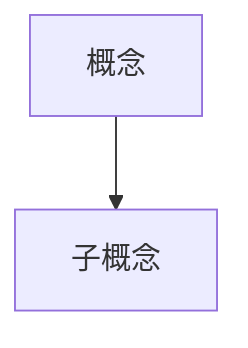

# Paper Tutor

Multi-agent swarm system for teaching academic papers through deep, parallel chapter explanations.

## Core Philosophy

Paper Tutor uses a **swarm of specialized agents** to transform complex academic papers into understandable, interconnected lessons. Unlike summarization, this skill focuses on **teaching and understanding**.

**Key architectural principles:**

1. **Teaching, not summarizing**: Each concept is explained with prerequisites, examples, visualizations, and context
2. **Swarm communication**: Chapter agents coordinate through shared working memory to avoid redundancy and ensure coherence
3. **Specialized roles with clear boundaries**:
   - **Coordinator**: Task assignment, progress tracking
   - **Figure Analyst**: ONLY agent allowed to write figure analysis (enforced by signature)
   - **Chapter Agents**: Explain concepts, update shared memory (CANNOT write figure analysis)
   - **Editor-in-Chief**: Reviews all chapter outputs, must approve with score >= 4.0
4. **Structural enforcement**: Constraints are enforced through data signatures, not rules
5. **Multi-modal explanation**: Text + Mermaid diagrams + formula breakdowns + prerequisite knowledge boxes

---

## Workflow Overview

```
Pre-Step: Determine Output Location
  ↓
Step 0: Paper Structure Extraction
  ↓
Step 1: Initialize Shared Working Memory
  ↓
Step 2: Figure Extraction & Analysis (by Figure Analyst Agent)
  ↓
Step 3: Launch Chapter Agents (Parallel)
  ↓
Step 4: Editor-in-Chief Review (Each chapter must pass with score >= 4.0)
  ↓
Step 5: Agent Coordination (Concept Arbitration, Terminology)
  ↓
Step 6: Generate Final Output
  ↓
Step 7: Validation (Run validate_execution.py)
```

---

## Intensity Levels

| Level | Total Words | Chapter Agents | Per Concept | External Resources |
|-------|-------------|----------------|-------------|-------------------|
| **Light** | ~5,000 | 2 | 200-500 | Minimal (only when critical) |
| **Medium** | ~30,000 | 4-6 | 1,000-3,000 | Curated recommendations |
| **Heavy** | ~100,000 | Per-chapter | 5,000-20,000 | Integrated into explanations |

**Note**: Architecture is the same for all levels. Only agent count and depth vary.

---

## Pre-Step: Determine Output Location

**Action**: Ask user where to save the paper explanation.

**Recommended format**: `paper_tutor_YYYY-MM-DD_[paper-slug]/`

**Example**: "Attention Is All You Need" → `paper_tutor_2026-02-25_attention-is-all-you-need/`

---

## Step 0: Paper Structure Extraction

**Action**: Extract and parse the paper structure.

**Input formats**:
- PDF file (local path)
- ArXiv URL
- Direct PDF URL
- HTML paper page

**Extract**:
- Title, authors, year
- Chapter/section hierarchy
- All figures and tables (locations only, not analyzed yet)
- All equations (LaTeX)
- References

**Output**: Initialize `paper_metadata.json` with basic structure (figures array empty at this point)

---

## Step 1: Initialize Shared Working Memory

Create `shared_memory.json` with initial structure.

### Step 1.1: Generate Chapter Summaries

**CRITICAL**: Coordinator must generate chapter summaries during initialization.

For each chapter:
1. Extract the chapter text from the paper
2. Generate a 200-500 word summary
3. Assign to an agent
4. Set word count target based on intensity

### shared_memory.json Schema

```json
{
  "chapter_summaries": [
    {
      "chapter_id": "ch1",
      "title": "Introduction",
      "summary": "200-500 word summary...",
      "assigned_agent": "agent_1",
      "word_count_target": 5000,
      "status": "pending",
      "review_score": null,
      "reviewer": null,
      "review_comments": null
    }
  ],
  "terminology_registry": {},
  "concept_coverage_map": {},
  "communication": {
    "broadcast": [],
    "directed": []
  },
  "external_resources": [],
  "progress": {
    "coordinator": "completed"
  }
}
```

**For detailed schema**, see [references/shared-memory-schema.md](references/shared-memory-schema.md)

---

## Step 2: Figure Extraction & Analysis (by Figure Analyst)

### Step 2.1: Extract Images

```bash
python ~/.claude/skills/paper-tutor/scripts/extract_figures.py [PDF_PATH] -o [OUTPUT_DIR]/figures/
```

### Step 2.2: Launch Figure Analyst Agent

**CRITICAL**: Figure Analyst is the ONLY agent allowed to write `level1_summary`.

Launch via Task tool:

```
你是 Paper Tutor 的 Figure Analyst，专门负责论文图片分析。

## 你的任务

分析 `[OUTPUT_DIR]/figures/` 中的所有图片。

## 工具选择

1. 首先尝试使用 Read 工具读取图片（Read 工具支持图片）
2. 如果 Read 工具无法正确描述图片，标记 image_analysis.status = "unavailable"

## 输出要求

更新 `[OUTPUT_DIR]/paper_metadata.json`：

```json
{
  "image_analysis": {
    "status": "available|unavailable",
    "method": "read_tool_multimodal",
    "analyzed_at": "2026-02-25T10:00:00Z"
  },
  "figures": [
    {
      "file": "fig_xxx.png",
      "page": 3,
      "level1_summary": "1-2句话的图片描述...",
      "figure_type": "architecture_diagram|chart|table|visualization|formula|other",
      "key_elements": ["element1", "element2"],
      "analyzed_by": "figure_analyst_agent",
      "analyzed_at": "2026-02-25T10:00:00Z",
      "analysis_method": "read_tool_multimodal",
      "status": "analyzed"
    }
  ]
}
```

## 关键约束

1. **必须包含签名字段**：
   - analyzed_by: 必须是 "figure_analyst_agent"
   - analyzed_at: ISO 8601 时间戳
   - analysis_method: 使用的分析方法

2. **如果无法分析**：
   - 设置 image_analysis.status = "unavailable"
   - figures 数组留空

3. **Better no display than wrong**：
   - 不确定时跳过该图片
   - 不编造图片内容
```

### Figure Analysis Signature Enforcement

The validation script checks that `level1_summary` entries have proper signatures:

```json
{
  "file": "fig_3_0.png",
  "level1_summary": "...",
  "analyzed_by": "figure_analyst_agent",  // Required if level1_summary exists
  "analyzed_at": "2026-02-25T10:00:00Z",   // Required if level1_summary exists
  "analysis_method": "read_tool_multimodal" // Required if level1_summary exists
}
```

**If a figure has `level1_summary` but missing `analyzed_by: "figure_analyst_agent"`, validation will fail.**

---

## Step 3: Launch Chapter Agents (Parallel)

Launch N chapter agents simultaneously based on intensity level.

### Chapter Agent Prompt Template

```
你是 Paper Tutor 的章节讲解智能体，负责讲解论文的「{SECTION_NAME}」章节。

## 你的任务

讲解你负责的章节，让读者真正理解其中的概念。

## 必须完成的步骤（按顺序）

### 1. 读取共享内存（CRITICAL - 第一步）

使用 Read 工具读取 `{OUTPUT_DIR}/shared_memory.json`，了解：
- chapter_summaries: 其他章节的摘要
- concept_coverage_map: 哪些概念已被其他 agent 讲解
- terminology_registry: 哪些术语已定义
- communication: 是否有发给你的消息

### 2. 读取图片元数据

使用 Read 工具读取 `{OUTPUT_DIR}/paper_metadata.json`：
- image_analysis.status: 图片分析是否可用
- figures[]: 图片列表及 Level 1 summary

**重要**：你只能 READ figures，不能 WRITE figures。

### 3. 读取你负责的章节

从 PDF 中读取「{SECTION_NAME}」的完整内容。

### 4. 识别并讲解核心概念

对于每个核心概念：
- 检查 concept_coverage_map 中是否已被其他 agent 覆盖
- 如果已覆盖，决定是引用还是协商归属
- 如果未覆盖，进行讲解并更新 concept_coverage_map

### 5. 选择并嵌入图片

如果 image_analysis.status == "available"：
- 根据 level1_summary 选择相关图片
- 嵌入图片到讲解中
- **不要自己分析图片**，直接使用 Figure Analyst 提供的 level1_summary

如果 image_analysis.status != "available"：
- 完全跳过图片，仅使用文字讲解

### 6. 更新共享内存

**必须**使用 Edit 工具更新 `{OUTPUT_DIR}/shared_memory.json`：
- concept_coverage_map: 注册你讲解的概念
- terminology_registry: 定义你引入的术语
- progress: 标记你的任务为 "pending_review"

### 7. 输出讲解内容

将讲解写入 `{OUTPUT_DIR}/chapters/chapter_{XX}_output.md`

## 讲解要求

- 强度级别：{INTENSITY}
- 目标字数：{TARGET_WORDS}
- 每个概念需要：通俗讲解、可视化（Mermaid）、举例说明
- 图片嵌入到相关概念中

## 完成后

更新 shared_memory.json 中你的章节状态为 "pending_review"，等待 Editor-in-Chief 审核。
```

**For detailed chapter agent workflow**, see [references/chapter-agent-workflow.md](references/chapter-agent-workflow.md)

---

## Step 4: Editor-in-Chief Review

**CRITICAL**: Every chapter MUST be reviewed and approved by Editor-in-Chief before final output.

### Editor-in-Chief Prompt Template

```
你是 Paper Tutor 的 Editor-in-Chief，负责审核所有章节讲解的质量。

## 你的任务

审核 Chapter Agent 产出的讲解内容，确保质量达标。

## 审核步骤

### 1. 读取章节讲解

读取 `{OUTPUT_DIR}/chapters/chapter_{XX}_output.md`

### 2. 读取图片元数据

读取 `{OUTPUT_DIR}/paper_metadata.json`，验证图片引用是否正确

### 3. 评估维度（每项 1-5 分）

1. **内容准确性** (accuracy)
   - 概念解释是否正确
   - 公式是否准确
   - 图片引用是否正确

2. **讲解清晰度** (clarity)
   - 是否有类比和例子
   - 前置知识是否交代清楚
   - 术语是否解释

3. **结构完整性** (completeness)
   - 核心概念是否都覆盖
   - 是否有可视化（Mermaid）
   - 图片是否嵌入正确位置

4. **与其他章节一致性** (consistency)
   - 术语使用是否一致
   - 是否正确引用其他章节

5. **目标字数达成** (word_count)
   - 是否接近目标字数

### 4. 计算总分

total_score = (accuracy + clarity + completeness + consistency + word_count) / 5

### 5. 更新 shared_memory.json

```json
{
  "chapter_summaries": [
    {
      "chapter_id": "ch1",
      "status": "approved|needs_revision",
      "review_score": 4.2,
      "reviewer": "editor_in_chief",
      "review_comments": "..."
    }
  ]
}
```

## 通过标准

- **score >= 4.0**: approved
- **score < 4.0**: needs_revision（返回修改意见给 Chapter Agent）

## 如果需要修改

1. 在 shared_memory.json 中设置 status = "needs_revision"
2. 在 communication.directed 中发送修改意见给对应 Chapter Agent
3. Chapter Agent 修改后重新提交审核
```

### Chapter Review Status Flow

```
pending → pending_review → approved
                      ↘ needs_revision → pending_review → approved
```

---

## Step 5: Agent Coordination

### Concept Ownership Negotiation

When Agent A finds a concept already claimed by Agent B:

1. Agent A sends directed message to Agent B and Editor-in-Chief
2. Editor-in-Chief arbitrates
3. Decision is recorded in shared_memory.json

### Terminology Challenges

1. Agent A challenges Agent B's definition via communication.directed
2. Editor-in-Chief reviews both definitions
3. Final decision recorded in terminology_registry

---

## Step 6: Generate Final Output

After ALL chapters are approved (score >= 4.0), generate `paper_explanation.md`.

**Output structure**:

```markdown
# [Paper Title] - 深度讲解 [强度: Light/Medium/Heavy]

## 论文概览
- 标题、作者、发表信息
- 核心贡献概述
- 章节导航

---

## 第一章：[章节名]

### 📚 前置知识
> 在阅读本章前，你需要理解以下概念：

#### 概念A：[名称]
[简洁讲解，200字以内]

### 🎯 本章核心概念

#### 概念1：[名称]

**原文定义**：[引用原文]

**通俗讲解**：
[详细讲解]

**图解**：

[Figure Analyst 的分析解读]

**可视化理解**：


**举例说明**：
[具体例子]

---

## 附录

### A. 术语表
- 所有定义的术语

### B. 外部资源推荐
- 教程、博客、视频链接
```

---

## Step 7: Validation

**CRITICAL**: Run validation script before considering the task complete.

```bash
python ~/.claude/skills/paper-tutor/scripts/validate_execution.py [OUTPUT_DIR]
```

### Validation Checks

1. **Figure Analysis Signature**
   - Every figure with `level1_summary` must have `analyzed_by: "figure_analyst_agent"`
   - Missing signature = validation failure

2. **Chapter Review Approval**
   - Every chapter must have `status: "approved"`
   - Every chapter must have `review_score >= 4.0`
   - Every chapter must have `reviewer: "editor_in_chief"`

3. **Required Files**
   - paper_explanation.md exists
   - paper_metadata.json exists
   - shared_memory.json exists

4. **Content Validation**
   - Figures in metadata are referenced in explanation

### Validation Output

```
============================================================
Paper Tutor Execution Validation Report
============================================================

Output Directory: /path/to/output
Validated At: 2026-02-25T10:30:00Z

Overall Status: ✅ PASSED / ❌ FAILED
------------------------------------------------------------

✅ Required Files:
   - All required files exist

✅ Figure Analysis:
   - Figures analyzed: 4
   - Image analysis status: available
   - All figures have valid signatures

✅ Chapter Reviews:
   - Chapters reviewed: 3
   - All chapters approved with score >= 4.0

✅ Explanation Content:
   - All figures referenced in explanation

============================================================
```

---

## File Structure

```
[OUTPUT_DIR]/
├── paper_explanation.md              # Main output
├── paper_metadata.json               # Paper facts + figure analysis (Figure Analyst writes)
├── shared_memory.json                # Agent state + chapter reviews (All agents update)
├── figures/                          # Extracted paper figures
│   ├── fig_0_1_abc123.png
│   └── ...
├── chapters/                         # Individual chapter outputs
│   ├── chapter_01_output.md
│   └── ...
└── external_resources/               # Downloaded resources
    └── ...
```

---

## File Permissions

| File | Coordinator | Figure Analyst | Chapter Agents | Editor-in-Chief |
|------|-------------|----------------|----------------|-----------------|
| paper_metadata.json | Create, Read | Write figures[] | Read only | Read only |
| shared_memory.json | Create, Write | Read | Write concepts, terms, progress | Write reviews |

**Key constraint**: Chapter Agents CANNOT write to `paper_metadata.json.figures[]`.

---

## Tool Usage Summary

### Coordinator
- AskUserQuestion: Get paper source, intensity, output location
- Task: Launch Figure Analyst, Chapter Agents, Editor-in-Chief
- Write: Create directory structure, initialize files
- Bash: Run extract_figures.py, validate_execution.py

### Figure Analyst
- Read: View extracted figures (multimodal)
- Write: Update paper_metadata.json with figure analysis (with signature)

### Chapter Agents
- Read: shared_memory.json, paper_metadata.json, PDF content
- Edit: Update shared_memory.json (concepts, terms, progress)
- Write: Generate chapter output files
- mcp__brave-search__brave_web_search: Find external resources

### Editor-in-Chief
- Read: All chapter outputs, shared_memory.json, paper_metadata.json
- Edit: Update shared_memory.json with review scores and status

---

## Progressive Disclosure

**Detailed references**:

- **Shared memory schema**: [references/shared-memory-schema.md](references/shared-memory-schema.md)
- **Chapter agent workflow**: [references/chapter-agent-workflow.md](references/chapter-agent-workflow.md)
- **Formula explanation template**: [references/formula-template.md](references/formula-template.md)

---

## Tips

**Quality indicators**:
- Good explanations use analogies and examples
- Every technical term is either explained or linked
- Formulas include boundary conditions and practical implications
- Figures are "taught" not just described

**Common pitfalls to avoid**:
- Skipping Figure Analyst and writing figure descriptions yourself
- Not waiting for Editor-in-Chief approval
- Not running validation script
- Ignoring shared_memory.json and working in isolation
