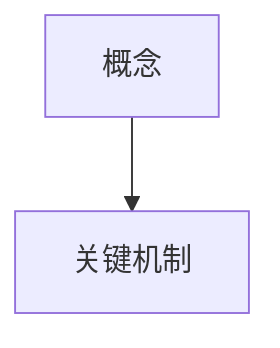

# Chapter Agent Workflow

用于章节智能体的执行规范（与 `SKILL.md`、`shared_memory.json`、`paper_metadata.json` 保持一致）。

## 目标

把分配章节写成“可教学”的内容，而不是摘要。读者读完后应能：
- 说清楚章节核心概念在解决什么问题
- 解释关键公式的变量含义与直觉
- 看懂该章节相关图表在表达什么

---

## 输入文件（必须按顺序读取）

1. `{OUTPUT_DIR}/shared_memory.json`
2. `{OUTPUT_DIR}/paper_metadata.json`
3. 原论文中你负责的章节全文

### 从 shared_memory.json 读取这些字段

- `chapter_summaries`
- `terminology_registry`
- `concept_coverage_map`
- `communication`
- `external_resources`
- `progress`

### 从 paper_metadata.json 读取这些字段

- `chapters`
- `equations`
- `image_analysis.status`
- `figures[]`（仅可读，不可写）

---

## 章节执行步骤

### Step 1. 建立本章讲解计划

识别 3-8 个核心概念，并决定：
- 哪些概念由你主讲
- 哪些概念引用其他章节（避免重复）
- 哪些概念需要图表支持

### Step 2. 处理跨章节冲突

如果 `concept_coverage_map` 已被其他 agent 占用：
- 先复用已有定义
- 若确实更适合在本章主讲，在 `communication.directed` 发协商消息

### Step 3. 写概念讲解（教学模板）

每个核心概念用以下结构：

```markdown
#### 概念：[名称]

**原文定义**：[原文句子或严格同义改写 + 章节/页码]

**通俗讲解**：
[解释“它是什么”]

**为什么需要这个概念**：
[解释“它解决了什么问题”]

**可视化理解**：


**举例说明**：
[最小例子，避免泛泛而谈]
```

### Step 4. 处理公式（如果本章有）

至少选择 1 个本章关键公式，使用 [formula-template.md](formula-template.md) 的简化模板：
- 公式本体
- 关键符号
- 一句直觉

### Step 5. 处理图表（如果可用）

仅当 `image_analysis.status == "available"` 时使用图片。

规则：
- 只能使用 `paper_metadata.json.figures[].level1_summary` 的事实
- 不得自行臆测图中细节
- 图片必须放在对应概念段落中，不放附录堆图

示例：

```markdown
**图解**：


基于 Figure Analyst 的要点：
- [要点 1]
- [要点 2]
```

### Step 6. 更新 shared_memory.json

完成章节后，至少更新：
- `concept_coverage_map`
- `terminology_registry`
- `progress`
- `chapter_summaries[i].status = "pending_review"`

### Step 7. 输出章节文件

写入：`{OUTPUT_DIR}/chapters/chapter_{XX}_output.md`

### Step 8. 自检（提交前）

必须全部满足：
- 有 `### 📚 前置知识`
- 核心概念小节数量 >= 3
- 若章节含公式：至少有 1 个公式讲解
- 若引用图片：图片说明来自 `level1_summary`
- 内容单位达标：`chinese_chars + english_words >= max(180, 0.35 * word_count_target)`

---

## 输出骨架（最小可用）

```markdown
# 第X章：[章节名]

### 📚 前置知识
- [前置知识 1]
- [前置知识 2]

### 🎯 本章核心概念

#### 概念：...
...

#### 概念：...
...

#### 概念：...
...
```

---

## 常见错误

- 只写摘要，不写“为什么需要这个概念”
- 添加未审核的新编号章节
- 把练习/扩展内容写成“第X章”而不是附录
- 图表描述脱离 `level1_summary`
- 不更新 `shared_memory.json`
