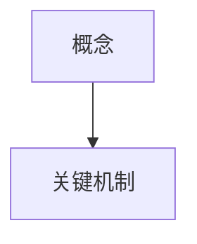
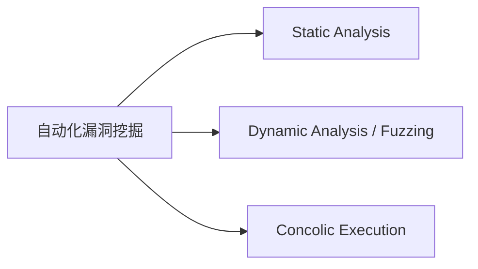

# Chapter Agent Workflow

用于章节智能体的执行规范（与 `SKILL.md`、`shared_memory.json`、`paper_metadata.json` 保持一致）。

## 目标

把分配章节写成"可教学"的内容，而不是摘要。读者读完后应能：
- 说清楚章节核心概念在解决什么问题
- 解释关键公式的变量含义与直觉
- 看懂该章节相关图表在表达什么

---

## 教学哲学（必读 - 核心价值观）

**你是一个老师，在为从未读过这篇论文的学生讲课。**

你的读者对这篇论文一无所知。他们不知道这篇论文在解决什么问题，不知道里面有哪些图表，不知道作者做了什么。你的任务是像在课堂上一样，从零开始为他们构建理解。

这意味着：
1. **叙事连贯**：每个小节自然衔接到下一个，不是一组互不相关的片段
2. **先铺动机再讲方法**：解释"为什么这个问题重要"之后才讲"这篇论文怎么做"
3. **声明式标题**：标题告诉读者"我接下来要教你什么"，而不是问读者一个问题
4. **图表是辅助**：图表嵌入讲解流程中，作为理解的辅助材料，而不是讲解的对象

### 禁止的反模式

**这些模式会被 Editor-in-Chief 和 validator 硬性拒绝**：

**Figure-centric（以图为中心）**：
- ❌ `#### 概念 3：Venn 图（Figure 5）` —— 以图为小节单位
- ❌ `#### 概念：Figure 1` —— 概念标题就是图编号
- ❌ `#### 概念 4：Driller 介入的时间线——Figure 6` —— 图编号占据标题
- ❌ "第一张图展示 X，第二张图展示 Y，第三张图展示 Z……" —— 逐图讲解叙事
- ❌ 每一个 `####` 小节只嵌入 1 张图并独立讲解它的 `level2_breakdown` 四项

**Q&A-centric（以问答为中心）**：
- ❌ `#### 为什么单纯 fuzzing 会卡在 magic check 上？` —— 问句标题
- ❌ `#### LLM 看似不适合符号分析——为什么反而可能成为关键突破？` —— 问句标题
- ❌ 每个小节是一个独立的"问题→答案"，小节之间没有过渡衔接

**症状**：当你发现自己在写"接下来看 Figure N ..."，或者每个小节标题都以 `？` 结尾，你已经掉进了反模式陷阱。

### 正确的模式（narrative teaching）

- ✅ `#### Driller 的定量效果：覆盖率与 crash 发现` → 讲解中引用 Venn 图 + Table I 作为证据
- ✅ `#### Driller 的核心循环：fuzzer 与 concolic 的交替协作` → 讲解中串讲 Figure 1-4 作为一条因果链
- ✅ `#### 纯 fuzzing 在 magic check 上的失效机制` → 讲解中用 Listing 1 + Figure 1 帮助理解
- ✅ 一个主题可以**消化 0 张图**（纯文字 + mermaid）、**1 张图**、**多张图作为一条叙事线**
- ✅ 一张图**只在一个主题下主讲**，但可以被其它主题回引（用文字引用，不重复嵌入）
- ✅ 每个 `####` 小节的结尾有一两句话**过渡到下一个小节**

**判断标准**：每个 `#### ...` 小节的标题应该是一个简短的**陈述性短语**。读者看到标题应该想"他要教我这个知识"，而不是"他在问我一个问题"或"他要给我看一张图"。

### 自拟教学示例是加分项（不是违规）

**论文讲解的价值之一**就是把作者留在正文里的抽象论证"翻译"成读者熟悉的场景。当论文只给出泛泛的描述（比如"假设存在一个检查某个魔数的程序……"）时，章节智能体**被鼓励**主动构造具体的、易懂的自拟例子，例如：

- ✅ 虚构一个包含 `if (magic == 0xDEADBEEF)` 和若干业务逻辑的银行转账程序，用来说明 fuzzer 为什么过不了 magic check、而 concolic 为什么会在业务逻辑里状态爆炸
- ✅ 用一个"快递员走迷宫"的类比来解释 fuzzer 探索 compartment 的过程
- ✅ 用一个具体的字符串 `"hello_world"` 举例说明 concolic 如何解 strcmp 约束

这些**不是原文内容、也不需要伪装成原文内容**。它们是教学增值，是"讲解"这个词的应有之义。

**边界**：
- 自拟示例必须**清楚地服务于某个讲解主题**（不是随手举例凑字数）
- 自拟示例**不能歪曲原文结论**，也不能把虚构的实验数据说成是论文的数据
- 自拟示例**可以不加特别标注**（"假设"/"比如"/"想象一下"这类口语化开场就够了），读者自然能看出这是教学举例而非原文引用

---

## 输入文件（必须按顺序读取）

1. `{OUTPUT_DIR}/shared_memory.json`
2. `{OUTPUT_DIR}/paper_metadata.json`
3. 原论文中你负责的章节全文

### 从 shared_memory.json 读取这些字段

- `chapter_summaries`
- `terminology_registry`
- `concept_coverage_map`
- `communication`
- `external_resources`
- `progress`

### 从 paper_metadata.json 读取这些字段

- `chapters`
- `equations`
- `image_analysis.status`
- `figures[]`（仅可读，不可写）—— 每一项包含 `file`、`belongs_to_chapter`、`level1_summary`、`level2_breakdown`、`figure_type`

### 筛选归属本章的图片

```python
my_figures = [f for f in metadata["figures"] if f.get("belongs_to_chapter") == my_chapter_id]
```

这组 `my_figures` 必须**全部**在章节输出中真实嵌入，否则会被 Editor-in-Chief 驳回。

---

## 章节执行步骤

### Step 1. 建立本章讲解提纲（narrative-first - CRITICAL）

**先写讲解提纲，再分配证据**。不要先看有几张图再决定讲几个概念——这条顺序一旦反过来就会掉进 figure-centric 陷阱。也不要先想"我要问读者什么问题"——这会产生 Q&A 风格输出。

#### 1.1 写出 3-8 个讲解主题

每个主题是一个简短的**陈述性短语**，表达你要为读者讲解的一件事情。主题之间应该有逻辑递进关系。例如（Driller 论文）：

- ✅ "纯 fuzzing 在 magic check 上的失效机制"
- ✅ "Driller 的核心循环：fuzzer 与 concolic 的交替协作"
- ✅ "Concolic 在整体和单 binary 层面的定量贡献"
- ✅ "Driller 的资源开销与可扩展性"
- ✅ "单个 CGC binary 上的完整执行过程观察"
- ❌ "Figure 5：Venn 图" —— 不是主题，是图编号
- ❌ "Table I 的分析" —— 不是主题，是动作
- ❌ "为什么单纯 fuzzing 会卡在 magic check 上？" —— 问句，读者会困惑"你为什么问我这个"

**硬性约束**：`####` 标题里**禁止**：
- 以 `？` 结尾（问句形式）
- 出现 `Figure \d+` / `图 \d+` / `Table [IVX]+` / `表 [IVX]+` / `Listing \d+` / `清单 \d+`
- 括号里包这些字符串也不行：`(Figure 5)` / `(Listing 7)` 都会被 validator 拒绝

如果你确实想让读者知道某主题会使用某些图作为证据，**写在主题小节开头的正文里**，而不是写进标题。

#### 1.1b 写一段章节开篇综述

在前置知识之后、第一个 `####` 之前，写 2-4 句话告诉读者：本章要带他们理解什么、核心洞察是什么、讲解的逻辑路线是什么。这给读者一张路线图。

#### 1.2 把 `my_figures` 映射到主题

筛出归属本章的图/表/listing：

```python
my_figures = [f for f in metadata["figures"] if f.get("belongs_to_chapter") == my_chapter_id]
```

然后做一张 **主题 → 证据** 的映射表（写在草稿里，不必放进最终输出）：

```
主题 A: "纯 fuzzing 在 magic check 上的失效机制"
  证据: Listing 1 + Figure 1

主题 B: "Driller 的核心循环：fuzzer 与 concolic 的交替协作"
  证据: Figure 1 → Figure 2 → Figure 3 → Figure 4 (一条时间线穿 4 张图)

主题 C: "Driller 的系统架构与组件分工"
  证据: 自画 mermaid 图 (原文没有架构图)
```

**映射规则**：
- 每张 `my_figures` 的图/listing 都必须被**至少一个**主题消化 —— 否则违反"图必须全部嵌入"的规则
- 一张图只在**一个**主题下"主讲"（嵌入 + 教学文字）；其它主题若要引用，用文字提及即可，不要重复嵌入
- 一个主题可以消化 0 张图（纯文字 + mermaid）、1 张图、或 2+ 张图串成一条叙事

#### 1.3 处理跨章节协调

- 哪些概念由你主讲
- 哪些概念引用其他章节（避免重复）
- 查 `concept_coverage_map` 是否已被占用

### Step 2. 处理跨章节冲突

如果 `concept_coverage_map` 已被其他 agent 占用：
- 先复用已有定义
- 若确实更适合在本章主讲，在 `communication.directed` 发协商消息

### Step 3. 写概念讲解（教学模板）

每个核心概念用以下结构：

```markdown
#### 概念：[名称]

**原文定义**：[原文句子或严格同义改写 + 章节/页码]

**通俗讲解**：
[解释“它是什么”]

**为什么需要这个概念**：
[解释“它解决了什么问题”]

**可视化理解**：


**举例说明**：
[最小例子，避免泛泛而谈]
```

#### Mermaid 图的源码-渲染鸿沟（硬性规则）

Mermaid 代码里的 `A[Static Analysis]`、`B[Dynamic Analysis / Fuzzing]` 等**节点 ID**（`A` / `B` / `C` / `D`）是**源码级别的内部标识符**：

- **作者看到的**：`.md` 源码里有 A / B / C / D 这些字母
- **读者看到的**：渲染后的图**只有 label 文字**（"Static Analysis"、"Dynamic Analysis / Fuzzing"），**节点 ID 完全不可见**

因此，**紧跟 Mermaid 代码块之后的叙事里，禁止用节点 ID 指代节点**。举例：



- ❌ "Driller 的故事发生在 **C 与 D** 的交界处"
  —— 读者看到的图上完全没有 C 和 D 字样，这句话像是在指天书
- ❌ "从 **A** 出发经过 **B** 到达 **C**"
  —— 同上，节点 ID 在渲染结果里不存在
- ✅ "Driller 的故事发生在 **Fuzzing 与 Concolic Execution** 的交界处"
  —— 引用的是 **label 文字**，读者可以在图里找到
- ✅ "从 **'自动化漏洞挖掘'** 出发经过 **'Static Analysis'** 到达 **'Dynamic Analysis / Fuzzing'**"
  —— label 文字直接可见

**判断方法**：把 Mermaid 代码块渲染出来想象一下——如果你只看渲染后的图，句子里提到的那个字母/符号**能不能在图上找到**？找不到就是泄漏了源码标识符。

**validator 会在章节提交时扫描 Mermaid 块后 15 行内的散落单字母引用**：当同一行出现 ≥2 个与本块节点 ID 相同的裸大写字母（如 `C 与 D`），视为硬失败，章节必须重写。

### Step 4. 处理公式（如果本章有）

至少选择 1 个本章关键公式，使用 [formula-template.md](formula-template.md) 的简化模板：
- 公式本体（必须用 LaTeX 渲染：`\$...\$` 行内，`\$\$...\$\$` 块级）
- 逐符号说明（禁止只列符号不解释关系）
- 一句直觉

**硬性规则**：章节内任何看起来像公式的内容（含等号、求和/积分符号、希腊字母、下标/上标）都必须用 LaTeX 渲染。纯文本公式一律驳回。

### Step 5. 将图表作为讲解的辅助材料嵌入

当 `image_analysis.status == "available"` 时：

**核心原则（再次强调）**：图是讲解的辅助材料，不是讲解本身。Step 5 的工作顺序是：

1. 打开 Step 1 写好的 **主题 → 证据** 映射表
2. 对每一个主题小节：**先写讲解的叙事**，再在合适的位置嵌入图表
3. 不要"看图写话"——先有话，再配图

#### 规则 1：一张都不能少（与之前一致）

`my_figures` 列表中的**每一项**都必须在本章至少出现一次真实的 Markdown 图片/代码块嵌入：

```markdown

```

遗漏任一张会被 Editor-in-Chief 驳回。

#### 规则 2：路径格式

- 允许：`figures/<filename>`
- 禁止：`../figures/<filename>`、绝对路径、`http://...`、`https://...`

#### 规则 3：图必须嵌在"某个主题"的叙事内部

这是本节最重要的规则。每张图在嵌入时，它所在的主题小节必须满足：

1. **前置叙事**：小节开头已经写了"这个主题在讲什么"的一段文字。读者读到图之前，已经知道"我为什么要看这张图"。
2. **图的嵌入点**：图出现在它**最能支撑论证的位置**，不一定是小节开头，也不一定是按论文原图顺序。
3. **后续叙事**：嵌入图之后，用一段 ≥150 字的中文把 `level2_breakdown` 的四项（what_to_look_at / axes_or_structure / key_observations / teaching_hook）**融合进讲解叙事**。不是列出四个子标题，而是自然地把它们串成"读者的视线动线 + 数据结构 + 关键发现 + 回到主题"的一段连贯教学文字。
4. **多张图共讲一个主题**：如果本主题的证据是 2 张以上的图（典型如 Driller 的 Figure 1-4 讲一次完整循环），这些图要在**同一个 `####` 小节内**依次嵌入，并在每两张图之间用"过渡叙事"连接（"第一张图告诉我们 X；下一步 concolic 介入之后……"）。

#### 规则 4：嵌入位置

图出现在它被"使用"的叙事旁边。不要：

- 把所有图堆在章节末尾
- 只在附录里用索引表列图
- 只提 "如图所示" 而不渲染
- 把一张图单独拆成一个 `#### 概念：Figure N` 小节（这是 figure-centric 反模式，会被硬性拒绝）

#### 规则 5：Listing 处理

`figure_type == "listing"` 的条目同样是讲解主题的辅助材料，不是讲解本身：

1. 读取对应的 `listings/listing_*.txt` 文件
2. 以 fenced code block 嵌入（```` ```c ````、```` ```python ```` 等带语言标记）
3. 代码块前后的叙事必须把它串到某个主题的讲解里。例如："为了说明 fuzzer 在 magic check 上的困境，论文给出了这段 25 行的 C 代码：[Listing 1] 请看第 7 行的 `config->magic != MAGIC_NUMBER`……"

#### 规则 6：表格处理

`figure_type == "table"`：同样作为证据嵌入某个主题。

- 策略 A：嵌入 `figures/table_*.png` 渲染图
- 策略 B：小表（≤5 行）重打为 Markdown 表格

两种策略都必须被包在一个"正在讲解某个主题"的叙事里。**不允许**把 table 本身作为 `####` 小节的标题（如 `#### 概念：Table I` 会被拒绝）。

**完整范例**：见 [multimodal-content.md](multimodal-content.md)。**Example 0 展示了"一个主题消化 4 张图"的正确形态，必读。**

**如果 `image_analysis.status != "available"`**：

跳过真实图片嵌入，在每个本应有图的位置用 Mermaid 重建结构，并加脚注说明原图未能提取。同样的"叙事优先"原则仍然适用——每个主题小节先写讲解叙事，再嵌入 Mermaid 作为辅助。

### Step 6. 更新 shared_memory.json

完成章节后，至少更新：
- `concept_coverage_map`
- `terminology_registry`
- `progress`
- `chapter_summaries[i].status = "pending_review"`

### Step 7. 输出章节文件

写入：`{OUTPUT_DIR}/chapters/chapter_{XX}_output.md`

### Step 8. 自检（提交前）

必须全部满足：

**结构**
- 有 `### 📚 前置知识`
- 核心概念小节数量 >= 3
- 内容单位达标：`chinese_chars + english_words >= max(180, 0.35 * word_count_target)`
- 没有新增编号章节（如 `## 第X章`）

**教学哲学（narrative-first，硬性）**
- **没有任何 `#### ...` 标题里出现 `Figure \d+`、`Table [IVX]+` 或 `Listing \d+`**（包括括号形式）。
- **没有任何 `#### ...` 标题以 `？` 结尾**（问句形式会让输出退化为 Q&A 复习材料）。检查命令：
  ```bash
  grep -nE '^#{3,4}\s.*(Figure\s*[0-9]|Table\s+[IVXLCDM]|Listing\s*[0-9]|？\s*$)' chapters/chapter_XX_output.md
  ```
  命中任何一行都是硬失败，必须改标题
- 章节有**开篇综述**（前置知识之后、第一个 `####` 之前），告诉读者本章要讲什么
- 每个 `####` 小节的结尾有**过渡语**自然衔接到下一个小节
- 多张图共讲一个主题时，图与图之间有"过渡叙事"连接（不是"接下来看 Figure 2"这种机械切换）
- 每个 `my_figures` 里的图都能清楚地对应到某个主题作为证据；如果有孤立的图（找不到它服务于哪个主题），回头重审 Step 1 的主题列表

**多模态（硬性）**
- `my_figures` 列表里**每一项**都已用 `` 语法嵌入
- 没有 `../figures/`、绝对路径或 URL 图片引用
- 每张嵌入图的**叙事窗口**（前后 ≥150 字中文）融合了 `level2_breakdown` 的 what_to_look_at / axes_or_structure / key_observations / teaching_hook，但**不是**把它们拆成 4 个子标题列出
- 如果章节有公式：全部用 `\$...\$` 或 `\$\$...\$\$` LaTeX 渲染，且每个符号有解释
- 如果 `my_figures` 含 `figure_type == "listing"`：代码已用 fenced code block 嵌入

**Mermaid 源码-渲染鸿沟（硬性）**
- 每个 ```` ```mermaid ```` 代码块之后的 15 行叙事里，**禁止**出现该代码块的**单字母节点 ID**（如 `A` / `B` / `C` / `D`）。必须用节点 label 文字（如 `"Fuzzing"` / `"Concolic Execution"`）
- validator 的高精度保护是"同一行出现 ≥2 个节点 ID"时硬失败（例：`C 与 D 的交界处`）。这是最典型的失败特征——两个 ID 并列指代"两个阵营的边界"——但**不要依赖 validator 的宽松模式**。即使单独一个 ID（`"在节点 C 上"`）也要改掉：它同样让读者迷惑
- 自检命令：
  ```bash
  # 找出所有 ```mermaid ... ``` 块后 15 行内的散落单字母引用
  python -c "
  import re
  text = open('chapters/chapter_XX_output.md').read()
  for m in re.finditer(r'\`\`\`mermaid\s*\n(.*?)\n[ \t]*\`\`\`', text, re.DOTALL):
      ids = set(re.findall(r'(?<![A-Za-z0-9_])([A-Z])\s*[\[\(\{>]', m.group(1)))
      if not ids: continue
      end = m.end()
      tail = text[end:].split('\n')[:15]
      for i, line in enumerate(tail):
          leaks = [c for c in re.findall(r'(?<![A-Za-z0-9_])([A-Z])(?![A-Za-z0-9_])', line) if c in ids]
          if len(set(leaks)) >= 2:
              print(f'Line {text[:end].count(chr(10))+1+i+1}: {line.strip()}')
  "
  ```

**自检脚本思路**（可以用 Bash 快速检查）：

```bash
# 1. 统计当前章节文件中 figures/ 引用数
grep -o "!\[.*\](figures/[^)]*)" chapters/chapter_XX_output.md | wc -l

# 2. 和 my_figures 数量对比
python -c "
import json
m = json.load(open('paper_metadata.json'))
my = [f for f in m['figures'] if f.get('belongs_to_chapter') == 'ch2']
print('Expected figures for ch2:', len(my))
for f in my:
    print('  -', f['file'])
"

# 3. 检查路径里是否有 ../
grep -n "(\.\./figures/" chapters/chapter_XX_output.md && echo 'FAIL: found ../figures/ paths' || echo 'OK'
```

---

## 输出骨架（最小可用）

```markdown
# 第X章：[章节名]

### 📚 前置知识
- [前置知识 1]
- [前置知识 2]

### 🎯 本章核心概念

#### 概念：...
...

#### 概念：...
...

#### 概念：...
...
```

---

## 常见错误

**内容层面**
- 只写摘要，不写"为什么需要这个概念"
- 添加未审核的新编号章节
- 把练习/扩展内容写成"第X章"而不是附录
- 图表描述脱离 `level1_summary` / `level2_breakdown`
- 不更新 `shared_memory.json`

**多模态层面（都会被 Editor-in-Chief 硬拒）**
- 图片只在"论文原图索引"表格中列出文件名，而没有用 `` 真实嵌入
- 图片用了 `../figures/` 相对路径（章节文件位于 `chapters/` 子目录，但 final merge 会把章节拼到 output 根目录，所以应该用 `figures/` 而非 `../figures/`）
- 图片嵌入后只有一行 caption，没有 ≥150 字的教学段落
- 公式写成纯文本（`rho = ...` / `sum from i=1 to n`）而不是 LaTeX
- 公式用 LaTeX 但没解释符号含义
- `figure_type == "listing"` 的条目只口头提到 "Listing 1"，没有真正嵌入代码块
- 把表格数据重打成 Markdown 表格**同时**又嵌入原图 PNG（重复，两者选一）
- **Mermaid 节点 ID 泄漏到散文**：在 ```` ```mermaid ```` 代码块（`A[label1] --> B[label2]`）后面的叙事里用 `A` / `B` / `C` / `D` 这种裸字母指代节点。读者只能看到 label 文字（`label1`、`label2`），看不到 ID。根本原因是写作者把"源码里看到的"当成"读者看到的"。修复：改用 label 文字（`"label1 与 label2 的交界处"`）。validator 的高精度硬检查是"同一行出现 ≥2 个节点 ID"时报错
