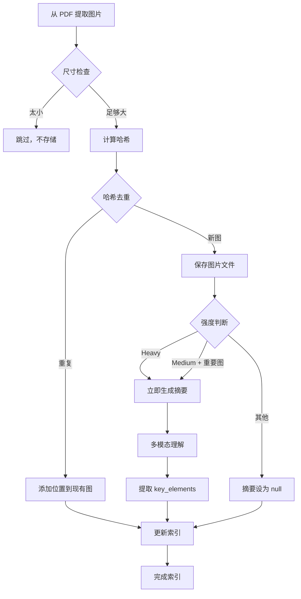

# Figure Extraction and Indexing

论文图表提取、索引和查找的完整流程。

## 概述

图表处理系统负责：
1. 从 PDF 中提取所有图表（位图和矢量图）
2. 过滤太小的图
3. 哈希去重
4. 启发式分类（不使用多模态模型）
5. 创建多键索引
6. 按需生成多模态理解

## 实际脚本

**完整实现**：参见 [`scripts/extract_figures.py`](../scripts/extract_figures.py)

该脚本提供了完整的图表提取功能，包括：
- 位图和矢量图提取
- 尺寸过滤
- MD5 和感知哈希去重
- 命令行接口

**使用方法**：
```bash
python scripts/extract_figures.py paper.pdf -o figures/
```

---

## 图片类型：位图 vs 矢量图

| 类型 | 格式 | 特点 | 提取方式 |
|------|------|------|---------|
| **位图** | PNG, JPG | 像素数据，固定分辨率 | 直接提取 |
| **矢量图** | SVG, EPS, PDF绘图指令 | 数学描述，可缩放 | 渲染或提取指令 |

### 提取策略（核心概念）

**完整实现**：参见 [`scripts/extract_figures.py`](../scripts/extract_figures.py)

#### 位图提取
```python
import pymupdf

doc = pymupdf.open("paper.pdf")
page = doc[0]

# 获取图片列表
image_list = page.get_images()

for img in image_list:
    xref = img[0]  # 图片引用

    # 提取图片
    base_image = doc.extract_image(xref)
    image_bytes = base_image["image"]

    # 保存
    with open(f"image_{xref}.png", "wb") as f:
        f.write(image_bytes)
```

#### 矢量图检测和提取
```python
# 获取矢量图（绘图指令）
try:
    clusters = page.cluster_drawings()  # 推荐：聚合相邻绘图
except AttributeError:
    clusters = page.get_drawings()  # 旧版本备用

for cluster in clusters:
    rect = cluster["rect"]  # 边界矩形

    # 渲染为位图
    pix = page.get_pixmap(clip=rect)
    pix.save("vector.png")
```

#### 判断是否是图表
```python
def is_diagram(cluster):
    rect = cluster["rect"]
    items = cluster.get("items", [])

    # 面积检查
    if rect.width * rect.height < 10000:
        return False

    # 绘图指令检查
    if items:
        line_count = sum(1 for item in items if item[0] in ['l', 'cs'])
        rect_count = sum(1 for item in items if item[0] == 're')
        if rect_count >= 3 and line_count >= 3:
            return True

    return False
```

---

---

## 流程图



---

## 1. 提取和过滤

### 尺寸阈值

```python
MIN_WIDTH = 100
MIN_HEIGHT = 100
MIN_AREA = 10000  # 100x100
```

### 过滤逻辑

```python
def is_too_small(img):
    width, height = img.size
    area = width * height

    if width < MIN_WIDTH or height < MIN_HEIGHT or area < MIN_AREA:
        return True
    return False
```

**被过滤的图**：
- Emoji（16x16, 32x32）
- 小图标
- 装饰性元素

**注意**：被过滤的图不存储在文件系统中，也不在索引中。

---

## 2. 哈希去重

### 哈希计算

```python
def compute_image_hash(img):
    import imagehash
    import hashlib

    # 感知哈希（检测相似图片）
    perceptual = str(imagehash.phash(img))

    # MD5（精确匹配）
    md5 = hashlib.md5(img.tobytes()).hexdigest()

    return {
        "perceptual": perceptual,
        "md5": md5
    }
```

### 去重策略

```python
def check_duplicate(img_hash, lookup):
    # 精确重复
    if img_hash["md5"] in lookup["by_hash"]:
        return True, "exact"

    # 视觉相似
    if any(fig["image_hash"]["perceptual"] == img_hash["perceptual"]
           for fig in figures):
        return True, "similar"

    return False, None
```

---

## 3. 多键索引

### 索引结构

```yaml
lookup:
  by_location:
    "p3-Figure 1": "fig_001"
    "p3-Figure 2": "fig_002"
  by_original_number:
    "Figure 1": "fig_001"
    "Figure 2": "fig_002"
  by_hash:
    "1a2b3c...": "fig_001"
```

### 查找方式

```python
def find_figures(page=None, figure_number=None, chapter=None):
    index = load_shared_memory()["figures_index"]
    results = []

    for fig in index["figures"]:
        for loc in fig["locations"]:
            match = True

            if page is not None and loc["page"] != page:
                match = False

            if chapter is not None and loc.get("chapter") != chapter:
                match = False

            if figure_number is not None and loc.get("original_number") != figure_number:
                match = False

            if match:
                results.append(fig)
                break  # 避免重复添加

    return results  # 返回所有匹配的图
```

---

## 4. content_summary 生成策略

### 渐次披露原则

| 强度 | 何时生成 | 生成范围 |
|------|---------|---------|
| **Light** | 按需 | 智能体需要时 |
| **Medium** | 立即 | 仅重要图 |
| **Heavy** | 立即 | 所有图 |

### 重要图判断

```python
def is_important_figure(img):
    # 大图
    if img.area > 500000:
        return True

    # 架构图、流程图
    if img.type in ["architecture_diagram", "flowchart"]:
        return True

    # 有明确编号
    if img.figure_number and "Figure" in img.figure_number:
        return True

    return False
```

### 按需生成

```python
def get_figure_with_understanding(figure_id):
    fig = get_figure_by_id(figure_id)

    if fig["multimodal_understanding"] is None:
        # 按需生成
        img = read_image(fig["original_file"])
        understanding = understand_image(img)

        fig["content_summary"] = understanding["summary"]
        fig["key_elements"] = understanding["elements"]
        fig["multimodal_understanding"] = understanding

        update_shared_memory(figure_id, fig)

    return fig
```

---

## 5. 文件结构

```
[OUTPUT_DIR]/
├── figures/                          # 提取的原图
│   ├── fig_001_1a2b3c4d.png
│   ├── fig_002_9z8y7x6w.png
│   └── ...
├── shared_memory.json                # 包含 figures_index
```

---

## 6. 使用示例

### 智能体查找图片

```python
# 场景 1：按页查找
figures = find_figures(page=5, chapter="ch3")
# 返回第3章第5页的所有图

# 场景 2：按编号查找
figures = find_figures(figure_number="Figure 1")
# 返回所有 Figure 1（可能在不同章节）

# 场景 3：组合查找
figures = find_figures(page=5, figure_number="Figure 2")
# 返回第5页的 Figure 2
```

### 智能体使用图片

```python
# 获取图片并确保有摘要
fig = get_figure_with_understanding("fig_001")

# 在讲解中引用
print(f"")
print(fig.content_summary)  # 智能体可以快速理解图片内容
```
