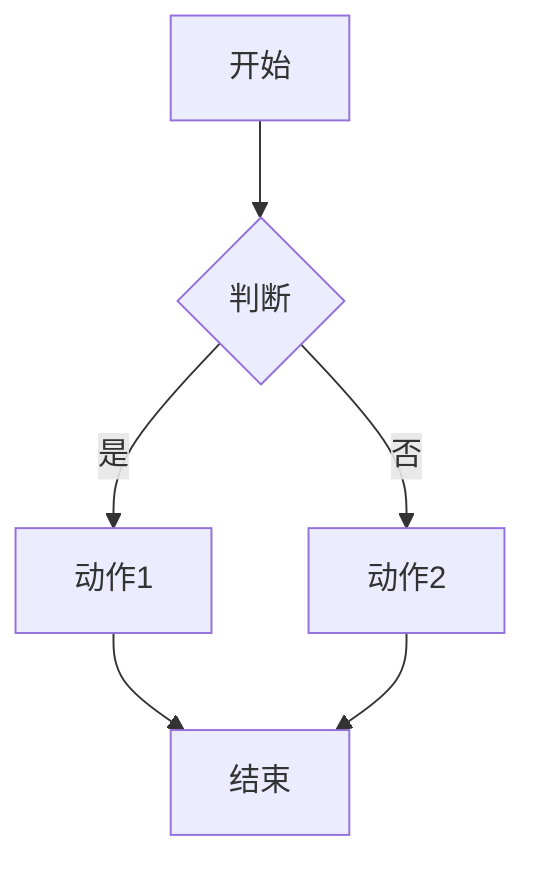
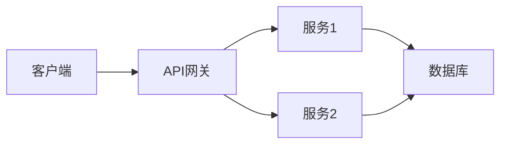
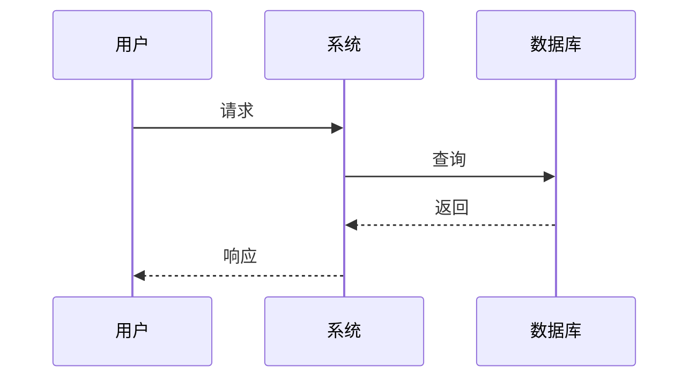
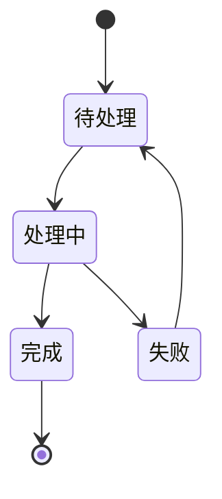

# Figure Handling Guide

图表处理的决策树和最佳实践。

## 图表类型决策

```
收到一张图表
    │
    ▼
是什么类型？
    │
    ├─ 流程图/算法 ──────────► Mermaid flowchart
    ├─ 系统架构 ──────────────► Mermaid graph
    ├─ 时序交互 ──────────────► Mermaid sequence
    ├─ 实体关系 ──────────────► Mermaid erDiagram
    ├─ 状态转换 ──────────────► Mermaid stateDiagram
    │
    ├─ 实验结果曲线 ──────────► 描述 + 原图引用
    ├─ 数据表格 ───────────────► Markdown table
    ├─ 照片/真实图像 ──────────► 描述 + 原图引用
    │
    └─ 复杂科研图 ─────────────► 尝试 Mermaid，如果太复杂则引用原图
```

---

## Mermaid 可重现的图表类型

### 1. 流程图 (flowchart)



**适用于**：算法流程、处理步骤

**何时使用**：
- 原图是流程图
- 需要简化复杂流程
- 需要添加解释性标注

### 2. 架构图 (graph)



**适用于**：系统架构、模块关系

### 3. 时序图 (sequence)



**适用于**：交互流程、API调用

### 4. 状态图 (stateDiagram)



**适用于**：状态机、生命周期

---

## 不可重现的图表类型

### 实验结果曲线

**处理方式**：描述 + 原图引用

```markdown
#### 图5：训练收敛曲线

**原图**：


**这张图展示了**：模型训练过程中 Loss 的变化

**如何阅读**：
1. X轴：训练步数（0 - 100k）
2. Y轴：Cross-Entropy Loss
3. 蓝线：Transformer
4. 橙线：LSTM baseline

**关键观察**：
- Transformer 收敛更快（约 20k 步）
- Transformer 最终 Loss 更低
- 两条曲线都在 50k 步后趋于稳定

**为什么重要**：
- 证明了 Transformer 的训练效率
- 暗示了模型容量优势
```

### 复杂数据图

**处理方式**：提取关键数据

```markdown
#### 表1：模型参数对比

| 参数 | Transformer | LSTM | GRU |
|------|-------------|------|-----|
| d_model | 512 | - | - |
| Layers | 6 | 2 | 2 |
| Heads | 8 | - | - |

**关键发现**：
- Transformer 使用多头注意力
- 深度网络（6层）vs 浅层网络（2层）
```

---

## 图表讲解模板

### 模板：可重现的图

```markdown
#### 图X：[标题]

**原图引用**：


**这个图展示了**：[核心内容]

**简化流程图**：
```mermaid
[Mermaid 代码]
```

**关键组件**：
- 组件A：[作用]
- 组件B：[作用]

**数据流动**：
1. [步骤1]
2. [步骤2]
3. [步骤3]

**与其他章节的关联**：
- 依赖章节X的概念Y
- 被章节Z引用
```

### 模板：不可重现的图

```markdown
#### 图X：[标题]

**原图引用**：


**图意**：这张图想要表达的是...

**如何阅读**：
1. 首先看X轴代表...
2. Y轴表示...
3. 不同颜色/形状的线/柱表示...

**关键发现**：
- 发现1：[描述]
- 发现2：[描述]
- 发现3：[描述]

**深入理解**：
这个图的关键洞察是...

**与其他章节的关联**：
- 验证了章节X的结论
- 与章节Y的图Z对比...
```

---

## 查找和引用图表

### 在共享内存中查找

```python
# 按页查找
figures = find_figures(page=5, chapter="ch3")

# 按编号查找
figures = find_figures(figure_number="Figure 1")

# 获取图片并确保有理解
fig = get_figure_with_understanding("fig_001")
```

### 在 Markdown 中引用

```markdown
# 方式1：相对路径


# 方式2：使用共享内存中的路径


# 方式3：带链接
[点击查看大图](figures/fig_001_transformer_architecture.png)
```
