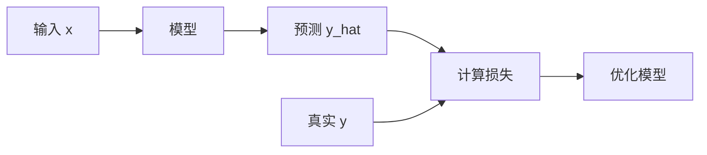

# Formula Explanation Template

公式讲解的详细模板和示例。

## 核心原则

讲解公式的目标是让读者**真正理解**，而不仅仅是知道每个符号的含义。

---

## 完整模板

```markdown
### 公式 X.Y: [公式名称]

$$
\mathcal{L} = -\sum_{i=1}^{N} y_i \log(\hat{y}_i)
$$

#### 逐符号讲解

| 符号 | 含义 | 取值范围 | 备注 |
|------|------|----------|------|
| $\mathcal{L}$ | 损失函数值 | $[0, +\infty)$ | 越小越好 |
| $N$ | 样本数量 | 正整数 | 批大小 |
| $y_i$ | 真实标签 | $\{0, 1\}$ | one-hot 编码 |
| $\hat{y}_i$ | 预测概率 | $(0, 1)$ | 经过 softmax |
| $\log$ | 自然对数 | - | 底数为 e |

#### 为什么需要这个公式？

在[章节/上下文]中，我们定义了[问题]。这个公式解决的问题是如何**量化预测与真实值的差距**。

#### 直觉理解

想象你在猜硬币正反面...

- 如果你100%确定且猜对，损失≈0
- 如果你猜错了，损失会很大

#### 推导过程（如果重要）

[可选：简短的推导步骤]

1. 从[基本原理]出发
2. 考虑[约束条件]
3. 得到[最终形式]

#### 边界情况

**当 $\hat{y}_i \to 0$ 但 $y_i = 1$**：
- 损失爆炸（数值不稳定）
- 工程上需要加 epsilon 防止 $\log(0)$

**当类别不平衡时**：
- 多数类主导损失
- 解决方案：使用加权交叉熵

#### 与其他公式的关联

- 见公式 3.2：这是该损失的梯度
- 见第5章：优化该损失的算法
- 见公式 2.1：从信息论角度推导

#### 代码实现（可选）

```python
def cross_entropy_loss(y_true, y_pred, epsilon=1e-10):
    y_pred = np.clip(y_pred, epsilon, 1 - epsilon)
    return -np.sum(y_true * np.log(y_pred))
```
```

---

## 简化模板（轻度强度）

```markdown
### 公式 X.Y

$$
公式
$$

**含义**：[一句话解释]

**关键符号**：
- $\mathcal{L}$: 损失
- $y_i$: 真实标签
- $\hat{y}_i$: 预测值

**直觉**：[简单的类比]
```

---

## 讲解技巧

### 1. 联系实际例子

```
公式：$E = mc^2$

直觉：
- 如果把一张纸完全转化为能量，可以照亮一个小镇
- 质量很小，但 $c^2$（光速平方）非常大
```

### 2. 分层讲解

```
第一层：公式在做什么？（优化、约束、量化...）
第二层：每个符号是什么？
第三层：为什么是这个形式？
第四层：边界情况和注意事项
```

### 3. 图示辅助



### 4. 公式对比

```
交叉熵 vs MSE：
- 交叉熵：适合分类
- MSE：适合回归

相同点：都是衡量差距
不同点：对错误的惩罚方式
```

---

## 常见错误

### ❌ 错误：只列出符号

```
× $\mathcal{L}$: Loss
× $N$: Number
× $y$: Label
```

### ✅ 正确：解释符号之间的关系

```
✓ $\mathcal{L}$: 损失，衡量 y 和 ŷ 的差距
✓ 当 y 和 ŷ 接近时，$\mathcal{L}$ 小
✓ 当 y 和 ŷ 差别大时，$\mathcal{L}$ 大
```

---

## 公式间的连接

```markdown
#### 公式链

```
公式 2.1（基础定义）
    ↓ 推导
公式 2.2（加入正则化）
    ↓ 简化
公式 2.3（最终形式）
```

在讲解公式 2.3 时，回溯到 2.1 的动机。
```
