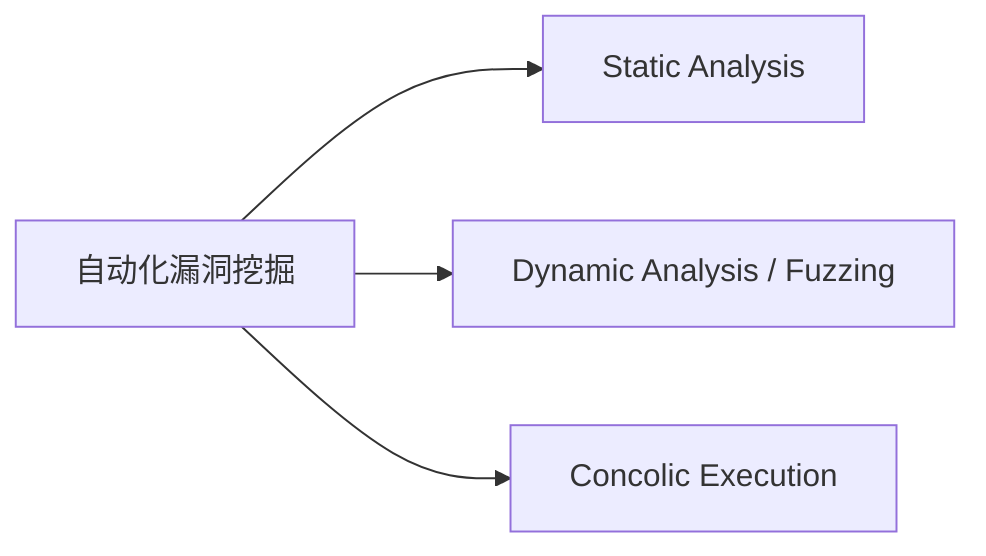

# Multi-modal Content: Golden Examples

**This file is required reading for every Chapter Agent.** It shows the exact shape of figure embedding, formula rendering, and code-listing embedding that the Editor-in-Chief expects.

## The Iron Rule: Concept-first, not figure-first

**Your chapter teaches propositions, not figures.** Figures, tables, listings, and formulas are *supporting evidence* for the proposition you are arguing. They are NOT the subjects of the explanation.

- **A proposition is a question or a claim** — "Driller 的一次完整循环是怎么跑的？", "为什么单纯 fuzzing 会卡在 magic check 上？", "Concolic 只在 fuzzer 卡住时介入，这个取舍的代价和收益分别是什么？"
- **A figure title is NOT a proposition** — "Figure 5", "Table I", "Listing 7", "Venn 图" are all nouns. They answer "what is this?" but never "why should I care?"

The single most common failure mode of the chapter agents is **one figure = one `####` heading**. That pattern turns your chapter into a guided museum tour of the paper's figures. It feels productive but leaves the reader with no unified understanding.

**See Example 0 below for the primary pattern.** Examples 1–4 are variations / edge cases.

## TL;DR

| What | Must look like | Must NOT look like |
|------|----------------|---------------------|
| **Chapter structure** | `####` headings are propositions (questions/claims); each proposition is supported by 0, 1, or several figures woven into ONE narrative | One `####` per figure (`#### 概念 3：Venn 图（Figure 5）`), one `####` per listing, one `####` per table |
| Figure | `` embedded inside a proposition's narrative, with ≥150-char connecting text that makes the figure an argument | Mentioned only by caption, rendered in `../figures/`, stuffed into an index table, or given its own `####` section |
| Formula | Single or double dollar-sign LaTeX, every symbol explained, used as evidence for a proposition | Plain text like `f(x) = sum from i=1 to n`, or a formula with its own `####` heading and no surrounding argument |
| Listing | Fenced code block (```` ```c ```` / ```` ```python ````) near the concept, with narrative tying it to a proposition | Pasted as inline text, skipped entirely, or given a `#### 概念：Listing 7` heading |
| Table | Either the rendered PNG from `figures/table_*.png` OR a markdown table with teaching paragraph — never both, never neither; used as evidence for a claim | Re-typed data without any teaching, or a `#### 概念：Table I` heading |

---

## Example 0 — Concept-first narrative (THE PRIMARY PATTERN)

**Read this example first. Examples 1–4 are variations.**

Driller's Section II motivates the design with a 4-figure walk-through: Figure 1 (fuzzer stuck) → Figure 2 (concolic solves one edge) → Figure 3 (fuzzer resumes and advances) → Figure 4 (fuzzer hits the next magic and concolic steps in again). The wrong instinct is to write one `####` section per figure. The right instinct is to write **one `####` section per proposition**, then weave the 4 figures into that section's narrative as evidence.

### WRONG: figure-centric (one `####` per figure)

```markdown
#### 概念 3：初始 Fuzzing 阶段（Figure 1）


Figure 1 展示了 fuzzer 在初始阶段的状态，红色节点是 abort()...

#### 概念 4：Concolic 第一次介入（Figure 2）


Figure 2 展示了 concolic 把边解开之后的状态...

#### 概念 5：Fuzzer 第二次跑（Figure 3）


Figure 3 展示了 fuzzer 拿到新 seed 之后的扩张...

#### 概念 6：Concolic 第二次介入（Figure 4）


Figure 4 展示了第二次 concolic 介入...
```

Why this fails review (every single bullet is a hard-fail):

- Four `####` headings each named after a figure. The reader walks out thinking "I saw four pictures" but not "I understand Driller's loop".
- The `####` titles are nouns ("Figure 1", "Figure 2"), not propositions.
- There is no single unifying claim the reader can carry away.
- The four figures are disconnected; no narrative hinges ("然后", "此时", "但是") bind them.
- The Editor-in-Chief's concept-first hard-fail regex triggers on "Figure \d+" inside `#### ...` titles.

### CORRECT: concept-first (one `####`, four figures woven into ONE narrative)

```markdown
#### 命题：Driller 的一次完整循环是怎么跑的？

要真正理解 Driller，不能把它想成"fuzzer 加一个 symex 插件"。它是一个**"fuzzer 卡住 → concolic 解一条边 → fuzzer 继续 → 再卡住 → concolic 再解一条边"** 的循环，循环的每一段都有一个自己的任务，彼此无法互换。我们顺着论文 Section II 的动机示例（Listing 1 的 CFG）把这条循环走一遍，用论文 Figure 1–4 这四张连续快照作为证据。

一开始，AFL 从空 seed 出发做 bit-flip / havoc 变异，很快能把 `read()` 之后的前几条 basic block 打亮。可是它马上就会停在 `challenge == response` 这个 32-bit 精确比较上——此时整张 CFG 里，入口附近被染成蓝色（已覆盖），右侧红色的 `abort()` 依旧是孤岛：


这张图要看的重点是**红色节点和它上游那条唯一的边**：fuzzer 没有任何办法凭空构造出让 `challenge == response` 成立的 4 字节 input，随机变异的命中期望是 \$2^{32}\$ 次，在工程上等于"跑不到"。整张 CFG 是自顶向下的基本块结构，蓝色区域表达"我已经走过"，未覆盖区域则是 fuzzer 被挡在墙外的证据。**这就是 Driller 循环的第一段任务：识别 fuzzer 已经"卡住"**——论文在第 III 节把这个判定交给 AFL 的 "no new coverage in N cycles" 信号。

一旦识别出卡住，Driller 不是重跑 fuzzer，而是让 concolic engine 接手：把 fuzzer 刚刚贡献的 seed 作为具体输入，在 angr 里做 symbolic execution，推进到那条被卡的边上，把路径约束 `challenge == response` 交给 SMT 求解器。求解器几乎是"秒回"——Z3 直接给出一组满足这条约束的 4 字节，Driller 把这组字节写成一个新 seed 文件塞回 AFL 的 queue：


Figure 2 的重点在红色边上新出现的"concolic 来源"标记。这是循环的**第二段任务**：只针对 fuzzer 卡住的那条边做一次符号求解，不尝试符号化整个程序。论文反复强调 "selective"，就是在强调"不要用 symex 去跑全部路径，只在 fuzzer 明确卡住时解开一条边"——因为符号执行的代价随路径数指数爆炸，而 fuzzer 对已覆盖区域的探索成本几乎为零。

fuzzer 拿到这条新 seed 之后，下一轮变异立刻能跨过 magic check，把原本灰色的下游 compartment 快速染蓝：


Figure 3 要和 Figure 1 对照着看才有意义——这是同一张 CFG，但蓝色区域已经几乎填满前半段 compartment。这正对应论文里那句 "fuzzer resumes and quickly discovers new basic blocks once seeded"，也是循环的**第三段任务**：让 fuzzer 再次接管，用它对高 throughput 变异的优势把 concolic 打开的这个缺口扩大到整个 compartment。

但故事并没有结束——很快下一个 magic check 又把 fuzzer 挡住，循环回到第一段：


Figure 4 的结构和 Figure 2 几乎是镜像，只是被解开的边移到了更深的位置。**这是整条循环的关键洞察**：Driller 不是跑一次就结束的 pipeline，而是一条可以反复收敛的循环，每转一圈只花 concolic engine 一次 per-compartment 调用。论文后面（第五节评测）给出的 "Driller 比纯 fuzzing 多找 9 个 crash" 这个数字，本质上就是"fuzzing + 一系列短而针对性的 concolic 介入"累加出来的——而不是 symex 单独能做到的，也不是 fuzzing 单独能做到的。

到这里，四张图连成了一个完整论断：**Driller 的创新点不在于任何一张图各自代表的状态，而在于这四张图连起来所体现的 "fuzzer 驱动、concolic 按需协作" 循环**。记住这个循环，我们在第五章讲 evaluation 时会反复回到它——表 II 的 crash 数字、Figure 6 的介入时间线、Figure 7 的 concolic 调用次数分布，本质上都是在量化这个循环在 126 个 CGC binary 上的表现。
```

### Why the CORRECT version passes

- **One `####` heading, and it is a proposition** (a question: "一次完整循环是怎么跑的？").
- **Four figures are woven into one narrative** — the reader gets ONE unified understanding of Driller's loop, with four figures as supporting evidence.
- **Connecting words do the work of turning 4 figures into 1 argument**: "一开始", "一旦识别出卡住", "fuzzer 拿到这条新 seed 之后", "但故事并没有结束". Without these hinges you'd have a photo album; with them you have an argument.
- **Each figure is followed by ≥150 chars of narrative** that fuses the `level2_breakdown` fields into the proposition — `what_to_look_at` becomes "这张图要看的重点是...", `axes_or_structure` becomes "整张 CFG 是自顶向下的...", `key_observations` are integrated into the argument, and `teaching_hook` is the bridge to the NEXT figure.
- **The four fields are NOT sub-headings**. No `**什么要看**` / `**结构**` / `**观察**` / `**教学钩**` bullet list. They are dissolved into flowing prose.
- **The section closes with a restatement of the proposition** ("Driller 的创新点不在于任何一张图各自代表的状态，而在于这四张图连起来...") so the reader leaves with the claim, not the figures.

### The judgment test

Before you write any `####` heading, ask yourself:

> **"If I only show the reader this `####` title, can they infer what question I am going to answer?"**

- ✅ `#### 命题：Driller 的一次完整循环是怎么跑的？` → reader knows "he's going to explain the loop"
- ✅ `#### 为什么单纯 fuzzing 会卡在 magic check 上？` → reader knows "he's going to explain the bottleneck"
- ✅ `#### Concolic 的介入为什么必须是 selective 的？` → reader knows "he's going to justify the 'selective' adjective"
- ❌ `#### 概念 3：Venn 图（Figure 5）` → reader knows "he's going to describe a figure"
- ❌ `#### State Transition Breakdown (Table I)` → reader knows "he's going to describe a table"
- ❌ `#### Listing 7-10 的案例研究` → reader knows "he's going to walk through some code"

Every "**he's going to describe X**" heading is a figure-centric failure. Every "**he's going to answer Y / argue Z**" heading is concept-first.

### Ratio rules of thumb

For a `my_figures` list of N figures assigned to your chapter:

- **1 figure → 1 proposition**: OK if that figure single-handedly answers one question. See Example 1.
- **2+ figures → 1 proposition**: **preferred** when the figures form a sequence, a before/after pair, or a comparison. See this Example 0.
- **1 figure → 0 propositions**: never. If you can't find a proposition a figure supports, ask Editor-in-Chief whether it should be reassigned to another chapter.
- **1 proposition → 0 figures**: also fine — not every concept needs a figure. Text-only reasoning is valid as long as the proposition is clearly argued.

**Forbidden**: `1 figure → 1 proposition` for EVERY figure in a chapter that has 4+ figures. That is exactly the figure-centric anti-pattern.

---

## Example 1 — Single-figure proposition (edge case: when one figure is enough)

This is the simpler case: a chapter has only ONE figure that happens to answer one clear question. You still write the `####` as a proposition, not as a figure name — but you only have one figure to weave in.

**What the Figure Analyst provided in `paper_metadata.json`:**

```json
{
  "file": "figure_1_bd89ab5c.png",
  "page": 5,
  "figure_number": "Figure 1",
  "caption": "Control flow graph of the program in Listing 1.",
  "belongs_to_chapter": "ch2",
  "level1_summary": "Driller 动机示例的控制流图：根节点是 read() 调用，之后分岔为 challenge == response 的真假两支，真支通向 abort()（红色节点）。",
  "level2_breakdown": {
    "what_to_look_at": "红色高亮的 abort() 节点和通向它的唯一边",
    "axes_or_structure": "自顶向下的 CFG：每个节点是一个 basic block，边是分支；红色节点 = crashing block",
    "key_observations": [
      "从 entry 到 abort 只有一条路径，且依赖一个 32-bit 精确比较",
      "随机 fuzzer 要猜中这条 magic 值的概率是 2^-32",
      "这张图是后面 Concolic Execution 动机的视觉锚点"
    ],
    "teaching_hook": "这就是纯 fuzzing 卡住的地方——路径很短，但入口条件苛刻；而 concolic 可以用 SMT 求解器直接反算出这条路径的 input。"
  }
}
```

**CORRECT chapter output** (this is what passes review):

```markdown
## 为什么单纯 Fuzzing 会卡住？

Driller 之所以需要把 concolic execution 接到 fuzzer 里，根源就在于 coverage-guided fuzzing 对"magic value"类分支的无能。让我们先看一段极简的 C 代码（Listing 1），它从 `/dev/urandom` 读 4 字节作为 challenge，再从 stdin 读 4 字节 response，只有两者完全相等时才触发 `abort()`。对应的控制流图长这样：


进入这张图时，请先把视线锁定在最下方那个被红色高亮的 `abort()` 节点，以及从上方 `if (challenge == response)` 条件节点指向它的那条边。整张图是一张标准的控制流图（CFG），每个方框是一个 basic block，方框之间的箭头代表跳转；入口在 `main` 的第一行，只有一条路径能到达红色的崩溃点。这里有三个关键观察：第一，从入口到 crash 只有一条路径，结构上毫无迂回；第二，这条路径却依赖一次 32-bit 精确比较，coverage-guided fuzzer 只能盲猜，期望命中次数是 \$2^{32}\$ 量级；第三，整张图把"结构简单 + 约束苛刻"这对矛盾摆到了台面上——这正是为什么 AFL 的 bit-flip / havoc 变异几乎不可能撞中 response 值。

换句话说，这张图是后面 Selective Concolic Execution 章节的视觉锚点：fuzzer 卡在这条边上，Driller 就让 concolic engine 把这条边上的路径约束 `challenge == response` 交给 SMT 求解器，立刻得到一组具体的 4 字节 input，再喂回 fuzzer 继续探索下游代码。记住这张图，我们在第四章 V.A 讲 concolic execution 时会回来再看一次，到时候红色节点就不再是绊脚石，而是 fuzzing 跨越符号屏障的第一块跳板。
```

**Why this passes**:

- Image is rendered with real markdown `` syntax at the point the text discusses the CFG.
- The teaching paragraph after the image covers all four required elements: what to look at (red node), structure (CFG basic blocks), 3 key observations, and the teaching hook (why it motivates concolic execution).
- Paragraph length is well over 150 Chinese characters.
- The path is `figures/figure_1_bd89ab5c.png`, not `../figures/...`, not absolute, not a URL.

**WRONG examples** (these all fail review):

```markdown
<!-- WRONG: only description, no actual image -->
如 Figure 1 (page 5) 所示，控制流图展示了 Driller 动机示例程序。

<!-- WRONG: broken relative path -->


<!-- WRONG: dumped into a global index table instead of embedded at point of discussion -->
## 论文原图索引

| 图 | 文件 | 页 |
|----|-----|----|
| Figure 1 | figures/figure_1_bd89ab5c.png | 5 |
| Figure 2 | figures/figure_2_4a5ed805.png | 5 |

<!-- WRONG: image embedded but with only a one-line caption, no teaching paragraph -->


这就是 Driller 要解决的问题。
```

---

## Example 2 — Formula rendering (hypothetical; Driller has no formulas)

**CORRECT**:

```markdown
### 状态转移覆盖率公式

论文在 VI.E 节用基本块迁移数来量化 fuzzing 进度。我们把每一条 `(from_bb, to_bb)` 记作一次 transition，累计集合 \$T\$ 就是已经发现的状态迁移集合。Driller 用如下比率衡量 concolic 对覆盖率的贡献：

$$
\rho = \frac{|T_{\text{concolic}} \setminus T_{\text{fuzz}}|}{|T_{\text{fuzz}}|}
$$

- \$T_{\text{fuzz}}\$ 是纯 AFL 在相同预算内发现的 transition 集合；
- \$T_{\text{concolic}}\$ 是 Driller（fuzzer + concolic）发现的 transition 集合；
- \$T_{\text{concolic}} \setminus T_{\text{fuzz}}\$ 是 concolic 额外贡献的新 transition；
- 分母 \$|T_{\text{fuzz}}|\$ 用来归一化，让不同 binary 之间可比较。

**边界情况**：当 \$|T_{\text{fuzz}}| = 0\$（fuzzer 根本没跑起来），\$\rho\$ 无定义，论文在这种情况下直接把该 binary 从统计中剔除。
```

**WRONG**:

```markdown
<!-- WRONG: plain text, not LaTeX -->
rho = (T_concolic - T_fuzz) / T_fuzz

<!-- WRONG: LaTeX without symbol explanation -->
$$\rho = \frac{|T_{\text{concolic}} \setminus T_{\text{fuzz}}|}{|T_{\text{fuzz}}|}$$

这个公式衡量 concolic 的贡献。
```

The second wrong example renders, but every reviewer will ask "what is \$T\$? what are those subscripts?" — so the Editor-in-Chief will reject it.

---

## Example 3 — Listing embedding (Driller Listing 1)

**What the Figure Analyst provided**:

```json
{
  "file": "listings/listing_1_4ba485bb.txt",
  "figure_number": "Listing 1",
  "belongs_to_chapter": "ch2",
  "figure_type": "listing",
  "level2_breakdown": {
    "axes_or_structure": "C 函数 main：先随机读 4 字节 challenge，再 stdin 读 response，相等则 abort()",
    "key_observations": [
      "challenge 来自 /dev/urandom，fuzzer 无法预判",
      "相等分支调用 abort() 产生 SIGABRT",
      "对 AFL 这类 coverage-guided fuzzer 几乎不可达"
    ],
    "teaching_hook": "这段代码是 magic-value 障碍的最小示例，用于解释为什么需要 concolic"
  }
}
```

**CORRECT chapter output**:

```markdown
下面是论文 Listing 1 给出的动机代码，我们先原样贴出来，再逐行拆解：

```c
int main(void) {
    int challenge, response;
    int fd = open("/dev/urandom", O_RDONLY);
    read(fd, &challenge, sizeof(challenge));
    read(0, &response, sizeof(response));
    if (challenge == response) {
        abort();
    }
    return 0;
}
```

这段 C 代码的结构极其简单：`main` 函数打开 `/dev/urandom` 读取 4 字节作为 `challenge`，再从标准输入（fd=0）读取 4 字节作为 `response`，当两者按 `int` 比较相等时调用 `abort()` 触发 SIGABRT。对 AFL 这类 coverage-guided fuzzer 而言，`challenge` 是每次运行时才确定的随机量，fuzzer 无法通过变异已知语料"猜中"这 32 位比特；即便 fuzzer 看到 `if` 的条件跳转在 coverage map 上新增了一条边，它也无从下手——bit-flip 变异的命中概率是 \$2^{-32}\$，在工程意义上等同于零。这正是 Driller 要解决的入门级难题：程序结构简单，但分支条件对 input 的约束太强。
```

**WRONG**:

```markdown
<!-- WRONG: code pasted as inline text -->
The motivating example is: int main(void) { ... read(0, &response, sizeof(response)); if (challenge == response) abort(); }

<!-- WRONG: fence without language marker (still works but loses syntax highlighting) -->
```
int main(void) {
    ...
}
```

<!-- WRONG: code present but no teaching paragraph after -->
```c
int main(void) { ... }
```

This is Listing 1.
```

---

## Example 4 — Tables

Driller has a single Table I with CGC dataset statistics. The `extract_figures.py` script produces `figures/table_I_*.png` containing the rendered table image. Chapter Agents can choose one of two valid strategies:

### Strategy A — embed the rendered image

```markdown


Table I 给出了 Driller 在评测时使用的 CGC 数据集全景：总共 126 个二进制，涵盖 6 种 CPU 架构，其中 X86 占 93%。这组数字解释了为什么 Driller 的评测以 X86 为主，也说明 CGC Qualifier 本质是一个 x86 单架构基准。后面第五章讨论 "Application Component Coverage" 时，我们会回到这张表看各架构下可触达 component 的比例差异。
```

### Strategy B — re-type the table as a small markdown table

This is only allowed when the table has ≤ 5 rows AND you add a teaching paragraph:

```markdown
| 架构 | Binary 数 | 占比 |
|------|----------|------|
| X86 | 117 | 93% |
| MIPS | 5 | 4% |
| ARM | 2 | 2% |
| 其他 | 2 | 1% |

（数据来自论文 Table I。）这张表的重点不在于具体数字，而在于 X86 的绝对主导地位：几乎所有评测结果都应该被理解为"在 x86 binary 上的平均表现"。在引用 Driller 结论时要记住这一点——它对 ARM / MIPS 类 IoT 固件的泛化性并没有被评测覆盖。
```

**WRONG**: re-typing the table AND embedding the image side-by-side without a teaching paragraph — this duplicates the data without adding any teaching value, and reviewers will ask you to pick one.

---

## Example 5 — Mermaid source-vs-rendered asymmetry (subtle, silent failure)

This example captures a failure mode that "looks perfectly fine in the `.md` source" but **breaks as soon as the Mermaid gets rendered**. Unlike the `../figures/` path bug (obvious, throws 404) or the figure-centric heading bug (caught by a trivial regex), this one slipped past human eyes and every existing validator until 2026-04-09.

### The bug

A Mermaid block defines nodes with **ID + label** syntax:



In the `.md` source, the author sees six tokens: `A`, `B`, `C`, `D`, plus the four label strings. But Mermaid's rendered output shows **only the label strings**. `A` / `B` / `C` / `D` are **internal identifiers** — they never appear on the rendered diagram.

The author, staring at the source code, forgets this asymmetry and writes the next paragraph using node IDs as if they were labels:

### WRONG: source-level identifiers leaking into prose

```markdown


这张图刻意把每个阵营的"好处"与"死穴"并列。Driller 的故事就发生在 **C 与 D 的交界处**：fuzzer 能跑但跑不深，concolic 能解但解不多，两边互补。
```

In the author's IDE, the prose "C 与 D 的交界处" looks like it points back to the Mermaid code above. But the reader, looking at the rendered result, sees a Mermaid diagram labeled "Static Analysis / Dynamic Analysis / Concolic Execution" and then a paragraph that mentions "C 与 D" — **two orphan single letters with no referent anywhere on the page**. The sentence is opaque.

### CORRECT: reference the visible label text

```markdown


这张图刻意把每个阵营的"好处"与"死穴"并列。Driller 的故事就发生在 **Fuzzing 与 Concolic Execution 的交界处**：fuzzer 能跑但跑不深，concolic 能解但解不多，两边互补。
```

Now the prose refers to "Fuzzing 与 Concolic Execution" — both strings are visible on the rendered diagram, so the reader's eye can jump directly from the paragraph back to the matching nodes.

### The root cause

**Rendered-versus-source asymmetry**: the chapter agent's mental model is "whatever I see in the `.md` is what the reader sees". That's true for markdown headings, bullets, and prose — but **false for Mermaid code blocks**, because Mermaid's `ID[label]` syntax is specifically designed to let the author use short mnemonics in source that get replaced with human-readable text at render time. The same asymmetry applies to any tool that compiles source-level identifiers away: Graphviz's `A -> B [label="foo"]`, PlantUML's `[A] --> [B] : arrow`, etc.

**How to avoid it**:

1. When writing prose right after a Mermaid / Graphviz block, **mentally render the diagram first** and imagine what a reader sees. If the paragraph mentions `A` / `B` / `C` / `D`, check whether those letters appear on the rendered image. If not, rewrite using label text.
2. **Never reuse a node ID as an abbreviation in prose**, even if the ID is a natural acronym. `C[Cache]` → don't then write "the C stores …"; write "the Cache stores …" or repeat `Cache`.
3. **Prefer descriptive multi-char IDs** over single-letter ones (`Fuzzer[AFL Fuzzer]` instead of `F[AFL Fuzzer]`). This doesn't eliminate the bug (the IDs are still invisible) but it reduces collateral damage when the bug does leak.

### What the validator catches

`validate_execution.py` extracts all single-uppercase-letter IDs from each Mermaid code block, then scans the next 15 lines of prose for standalone occurrences. The precision guard is "**≥2 distinct IDs on the same line**" — this matches the giveaway pattern (`C 与 D`, `A → B`, "从 A 到 B 的迁移") without false-firing on `"C 程序"` (C-language reference where a single `C` collides with a Mermaid ID). Single-letter orphans that don't co-occur with another ID on the same line are accepted as missed and must be caught during Editor-in-Chief review.

---

## Checklist before submitting to Editor-in-Chief

Run through this list for every chapter file you produce.

### Stage A — Concept-first (hard-fail if any box is unchecked)

1. [ ] **Before writing anything, I wrote down a list of 3–8 propositions this chapter argues** (questions or claims, NOT figure names).
2. [ ] **Every `####` heading in my chapter is a proposition** — a question or a claim, never just a figure / table / listing name.
3. [ ] **grep check**: running `grep -nE '^#{3,4}\s.*(Figure\s*[0-9]|Table\s+[IVXLCDM]|Listing\s*[0-9]|图\s*[0-9]|表\s*[IVXLCDM0-9]|清单\s*[0-9])' chapters/chapter_XX_output.md` returns **zero** lines.
4. [ ] **No `#### 概念 N：Figure X（...）` pattern** and no `#### 概念 N：Venn 图` / `#### 概念 N：Table I` / `#### 概念 N：Listing 7` — parentheses around the figure name also count as a violation.
5. [ ] **For every proposition, I can state in one sentence what claim the reader should take away** — not "I described X" but "I argued that X implies Y".
6. [ ] **When a proposition is supported by 2+ figures, those figures live in the SAME `####` section** with connecting narrative ("此时", "然而", "到这里") binding them into one argument. No per-figure sub-headings.

### Stage B — Multi-modal rendering (hard-fail if any box is unchecked)

7. [ ] Did I load `paper_metadata.json` and filter `figures[]` by `belongs_to_chapter == 本章 id`?
8. [ ] Did I embed every single one of those figures with `` syntax?
9. [ ] Is every path written as `figures/<filename>` (not `../figures/`, not absolute, not a URL)?
10. [ ] Does every embedded figure have ≥150 Chinese characters of **connected teaching narrative** (prose, not a bullet list) within the same section, fusing the `level2_breakdown` fields into the proposition's argument?
11. [ ] Are the `level2_breakdown` fields (what_to_look_at, axes_or_structure, key_observations, teaching_hook) **dissolved into flowing prose** rather than exposed as 4 sub-bullets or 4 sub-headings?
12. [ ] If the chapter has formulas, are they all wrapped in `\$...\$` or `\$\$...\$\$`? Is every symbol named? Is each formula used as evidence for a proposition?
13. [ ] If the chapter has listings, did I embed them as fenced code blocks with a language tag, AND tie each listing to a proposition with surrounding narrative?
14. [ ] Did I put figures at their point-of-discussion, not in an appendix-style index table?
15. [ ] **Mermaid source-vs-rendered check** (see Example 5): for every ```` ```mermaid ```` block, did I mentally render it and then check that the next 15 lines of prose never reference node IDs (`A` / `B` / `C` / `D`) as if they were visible labels? Every reference in the prose must use the **label text** (`Fuzzing`, `Concolic Execution`, …), not the source-level identifier. The validator hard-fails when ≥2 distinct node IDs appear on the same prose line (e.g. `C 与 D 的交界处`), which is the giveaway symptom.

If any Stage A box is unchecked, the Editor-in-Chief will hard-fail on "figure-centric structure" regardless of rendering quality. If any Stage B box is unchecked, the Editor-in-Chief will hard-fail on multi-modal rendering. Both stages must pass before setting status to `pending_review`.
